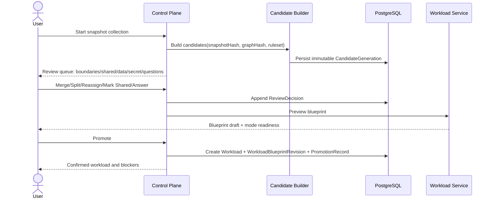
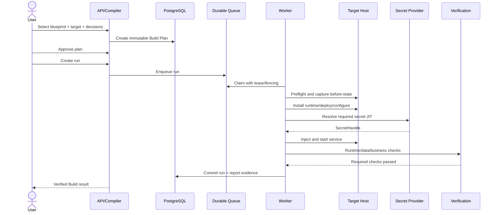
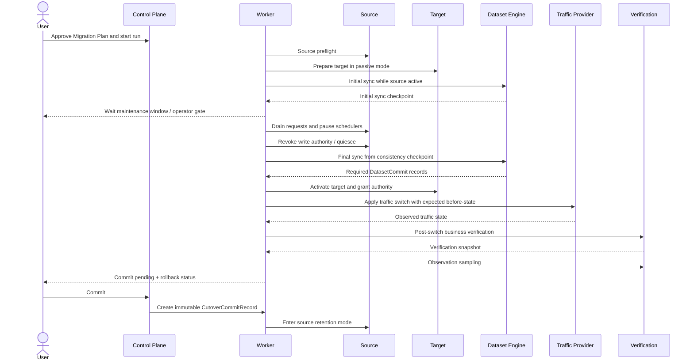
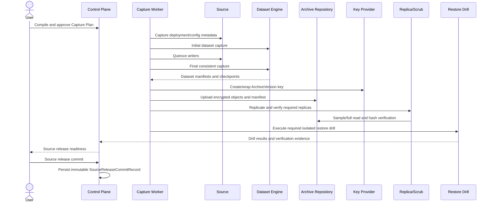
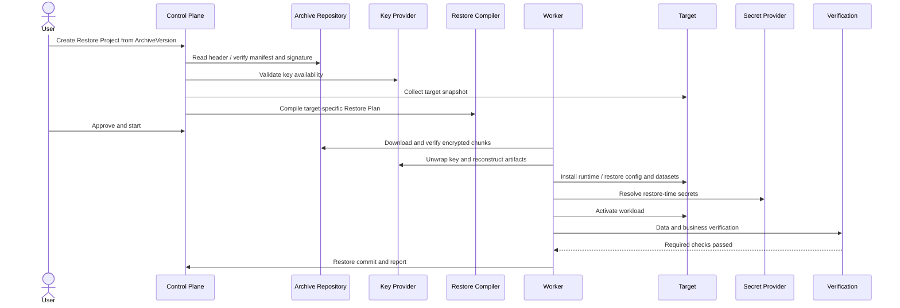
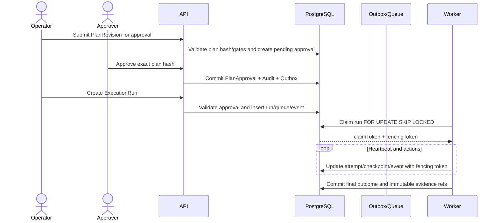
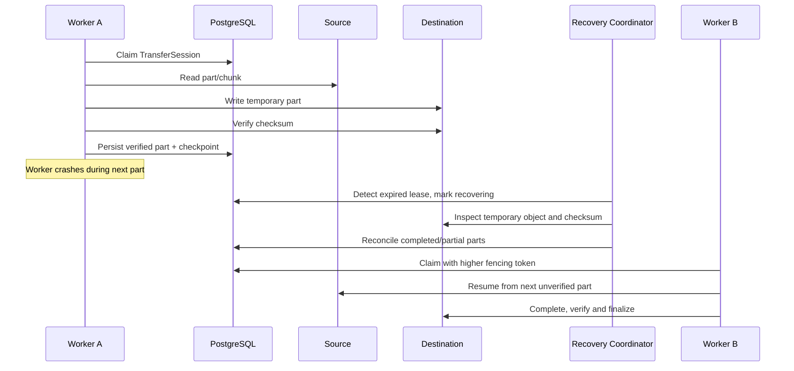
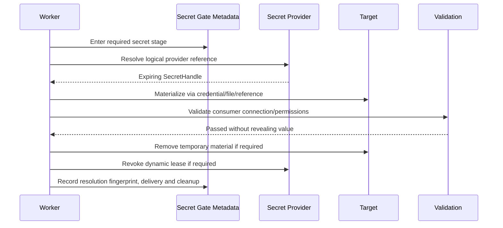
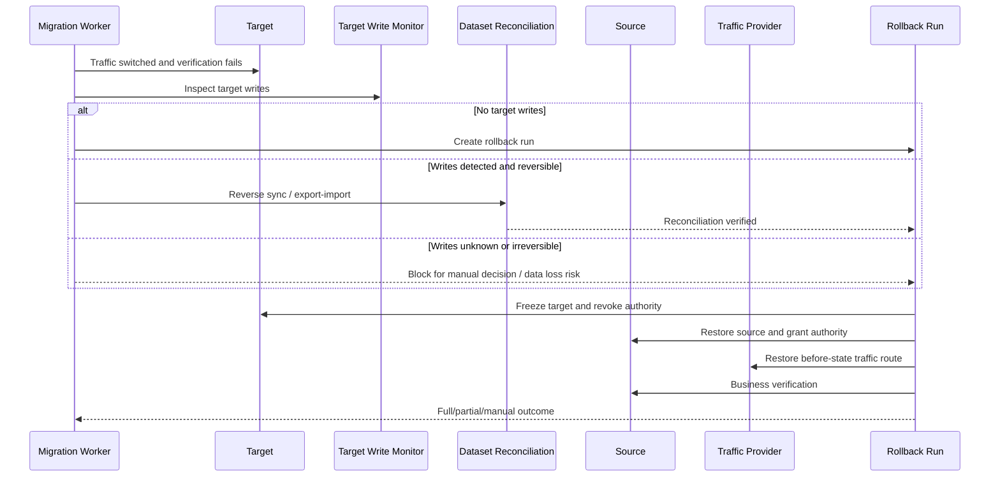
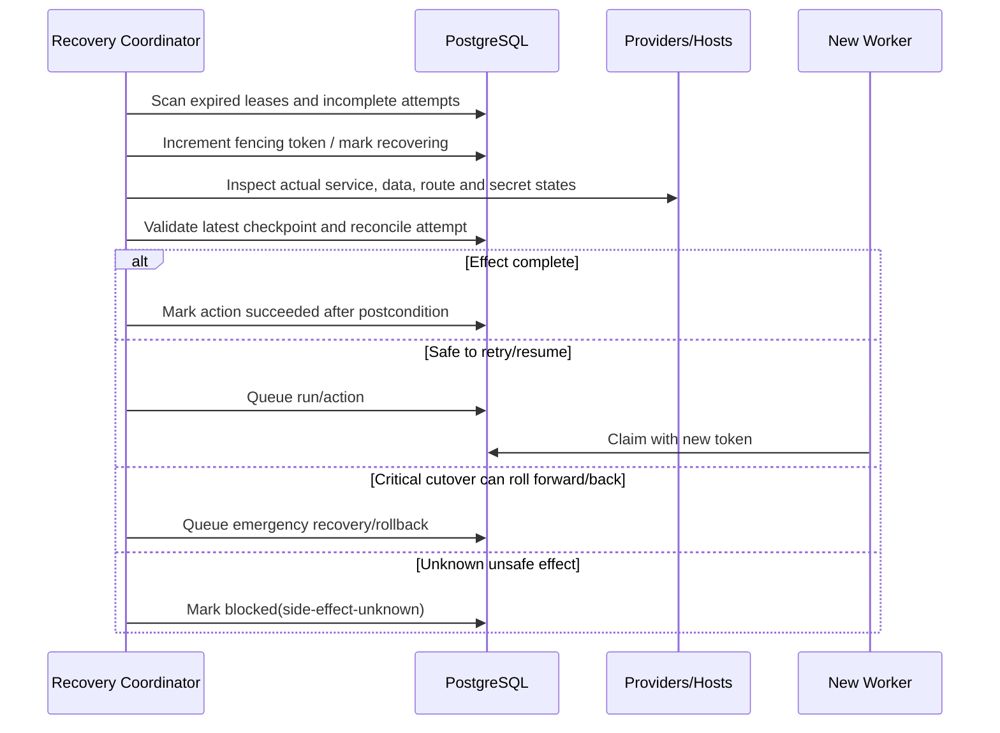

# EnvForge Overall Solution Design v1.1

> **设计标记**：`[已确认设计]` 表示架构基线；`[建议方案]` 表示实施阶段需通过评审确认；`[待决策]` 表示尚未冻结。若本文件与权威来源冲突，以 [`source-of-truth-map.md`](../00-governance/source-of-truth-map.md) 的映射为准。

## 文档定位

本文件是集成式架构基线，保留完整设计视图。拆分后的领域、执行、持久化、API 与安全文件是对应主题的权威规范；冲突处理遵循 `../00-governance/source-of-truth-map.md`。


**文档版本：** 1.1  
**状态：** Accepted Design Baseline — 已完成 v1 审计修复  
**决策口径：** 本文将内容区分为“已确认设计”“建议方案”“待决策事项”。  
**保密级别：** Internal / Engineering Design


# 文档信息

### 1.1 文档控制

| 项目 | 内容 |
|---|---|
| 文档名称 | EnvForge Overall Solution Design v1.1 |
| 当前版本 | 1.1 |
| 文档状态 | Accepted Design Baseline；核心领域决策已冻结，待决事项登记于 Open Questions |
| 编制日期 | 2026-07-19 |
| 目标读者 | 产品、架构、后端、前端、基础设施、安全、测试、运维、Capability 开发团队 |
| 主要用途 | 产品范围确认、架构评审、数据库与 API 设计、研发任务拆分、测试验收、发布能力声明 |
| 设计来源 | EnvForge 系列设计讨论、现有代码审计、已确认的领域模型与状态机决策 |

### 1.2 设计状态标记

| 标记 | 含义 |
|---|---|
| **已确认设计** | 已在本轮设计中明确确定，后续实现应默认遵守；变更需要 ADR |
| **建议方案** | 为使设计可以工程化而作出的推荐，尚需在对应实施阶段评审确认 |
| **待决策** | 会话中尚未明确，本文不得把它描述为已定事实 |

### 1.3 设计范围

本文覆盖 EnvForge 从服务器发现到长期恢复的完整产品与技术闭环：

- Assessment、Build、Migration、Capture、Restore 与 Preserve & Restore；
- Workload Candidate Review、Workload Blueprint、DecisionSet 与 Plan 编译；
- Durable Execution、Action DAG、Checkpoint、Retry、Crash Recovery；
- Dataset Migration、Secret Delivery、Cutover、Verification 与 Rollback；
- Environment Archive、对象存储、加密、Scrub、Restore Drill；
- 聚合边界、PostgreSQL 持久化、API、Outbox、Queue、Lease、Audit；
- 安全、可观测性、技术权衡、实施路线与验收标准。

### 1.4 非目标

EnvForge v1 不以以下能力为目标：

- 自动理解并无损迁移任意 Linux 或任意私有软件；
- 默认实现零停机、双活、多主或跨地域数据库迁移；
- 取代 Kubernetes、Terraform、Ansible、完整 CMDB、APM 或企业备份产品；
- 在没有用户确认业务边界、数据所有权和风险时自动执行高风险迁移；
- 保存所有源环境 Secret 明文；
- 允许未经审核的任意第三方插件在生产目标上执行任意 Shell；
- 在首期拆分为大量微服务或实现全面 Event Sourcing；
- 对未来任意硬件、操作系统和软件版本提供无限期恢复保证。

### 1.5 术语与缩写

| 术语 | 定义 |
|---|---|
| Environment | 一台或多台主机、网络入口和外部依赖共同形成的运行环境 |
| Workload | 具有稳定业务身份、可独立理解和管理的业务工作负载 |
| Candidate | 基于某个 Snapshot 的可解释但可能错误的 Workload 推断 |
| Evidence | Collector 获取的进程、服务、文件、端口、容器、数据库等事实 |
| Blueprint | 目标无关、版本化、不可变的 Workload 技术与恢复合同 |
| DecisionSet | 用户或策略对目标、数据、Secret、共享资源和风险的版本化决策 |
| Plan Revision | 针对特定输入编译的不可变执行合同 |
| Action | 结构化、可验证、带恢复语义的最小执行节点 |
| Action DAG | Action 及其依赖、阶段、资源锁组成的有向无环图 |
| Run | 对一个 Approved Plan 的一次真实执行实例 |
| Attempt | Action 的一次具体执行尝试 |
| Checkpoint | 可以证明某一安全恢复位置的持久证据 |
| Dataset | Workload 必须保留或恢复的持久状态集合 |
| Transfer Session | 一次可断点、可校验的字节或 Artifact 传输会话 |
| Secret Requirement | Blueprint 中对凭据、密钥或 Token 的需求定义 |
| Provider Binding | DecisionSet 中将 Secret Requirement 绑定到具体来源的决策 |
| Cutover | 从源端撤销写入权、完成最终同步、切流并提交目标权威性的过程 |
| Write Authority | 某个环境是否被允许产生权威业务写入的正式记录 |
| Verification | 证明 Artifact、运行时、数据和业务行为满足合同的检查 |
| Rollback | 基于实际 before-state 与已完成副作用执行的独立恢复过程 |
| Archive | 自描述、加密、不可变、可验证的长期恢复资产 |
| Scrub | 主动读取并验证 Archive 对象和密钥可用性的完整性作业 |
| Restore Drill | 在隔离环境实际重建 Artifact、Dataset 或 Workload 的恢复演练 |
| Capability | 某种软件或资源的检测、编译、执行、验证和回滚实现 |
| Adapter | Capability 的检测、规划或执行适配器 |
| CAS | Compare-And-Swap，基于版本号的条件更新 |
| DEK / KEK | Data Encryption Key / Key Encryption Key |
| RPO / RTO | Recovery Point Objective / Recovery Time Objective |

### 1.6 决策冲突与统一方案

以下冲突来自不同阶段的讨论，本文采用右侧统一口径。

| 冲突 | 统一方案 |
|---|---|
| Blueprint 曾出现 `planner-ready` 持久状态，也曾定义为按模式计算 | Blueprint Revision 只持久化 draft/confirmed/superseded/retired；Planner Readiness 按 Build/Migration/Capture/Restore 动态计算并保存评估结果 |
| Rollback 既被描述为原 Run 内状态，又被定义为独立 Run | Rollback 是独立 `ExecutionRun(type=rollback)`；原 Run 可以显示派生的 `rollback-required/rolling-back` 状态，但反向 Action、Attempt 与证据属于 Rollback Run |
| PostgreSQL 流程曾描述 initial dump + final delta | MVP 不把第二次 `pg_dump` 称为增量。小中型数据库在 Cutover 执行最终完整事务一致 dump/restore；近零停机依赖未来 logical replication Capability |
| Plan 状态出现 draft/confirmed/planner-ready 与 compiled/approved 两套命名 | PlanRevision 使用 compiled/review-required/approval-pending/approved/rejected/superseded/revoked/expired/archived；draft 属于编译输入或编译作业，不属于可执行 Plan |
| Archive Integrity 被设计为单一递增等级，同时又有多维健康 | 保留 IntegrityLevel 与 RecoverabilityLevel，但整体健康由 Manifest、Replica、Key、Scrub、Drill、Retention 多维计算，不使用单一枚举替代健康判断 |
| 消息队列有“独立消息队列”和“PostgreSQL Queue”两种表述 | v1 使用 PostgreSQL Durable Queue + Outbox；接口保持可替换，未来规模需要时可引入外部 Broker，PostgreSQL 仍为 Run 权威状态源 |
| Approval 绑定 Target Snapshot Hash，但运行前允许非关键 Drift | Approval 绑定原 Plan Hash；Run preflight 检测实时 Drift。非关键 Drift 记录证据后继续，Material Drift 阻止 Run 并要求重新编译和审批 |
| Archive plaintext hash 可能泄露内容相等性 | plaintext hash 只存在于加密 Manifest 或受保护索引；普通数据库和对象键优先使用 ciphertext hash 或 Workspace HMAC 标识 |

### 1.7 v1.1 审计修复决策

- Build、Restore、Capture 的成功提交统一建模为 `ExecutionCommitRecord`；Migration 额外生成 `CutoverCommitRecord`；释放源环境生成 `SourceReleaseCommitRecord`。
- Plan Compilation、Snapshot Collection、Scrub、Repair 等控制面长任务使用 `ControlPlaneOperation`；只有执行 Approved Plan 或独立 Verification/Rollback 才使用 `ExecutionRun`。
- PostgreSQL Queue Claim 更新 queue row 为 `claimed` 并保留审计；`worker_leases` 是 Lease 权威来源，Run 只保存 fencing epoch 与派生 claim 状态。
- Plan 支持多个 `WorkloadBlueprintRevision`，通过 `plan_input_bindings` 绑定 ID 与 Hash。
- Phase 路线统一为 Preparation + Phase 0–10；Phase 10 只负责全系统集成、Legacy Retirement 和 GA Closure。
- 叶子规范是主题事实源；Overall Design 不再重复维护正式状态转换、完整 API 或 DDL。

## 2. Executive Summary

### 2.1 要解决的问题

虚拟机或 VPS 的“换机”并不是简单复制磁盘。真实业务由操作系统、软件包、systemd 服务、容器、配置、数据库、上传目录、Secret、域名、证书、定时任务、外部依赖和运行时状态共同组成。传统方案经常只保存其中一部分，导致目标环境可以启动，但业务并不可用、数据不一致、Secret 缺失、流量切换不可回滚，或者数月后备份无法恢复。

EnvForge 的目标是把这一过程从“依赖个人经验的脚本和操作手册”转化为“可解释、可审批、可执行、可恢复、可验证的环境生命周期合同”。

### 2.2 产品定位

**已确认设计：** EnvForge 是一个以 Workload 为中心的自托管 Linux 环境生命周期平台，覆盖发现、构建、迁移、封存和恢复。它不是磁盘镜像工具，而是把业务环境编译成可执行计划，并以运行证据证明结果。

### 2.3 目标用户

首期目标用户为：

- 管理一到数十台 Linux VPS 的个人开发者或小型团队；
- 使用 systemd、Nginx、PostgreSQL、Docker Compose 的自托管服务用户；
- 需要更换主机、复制环境、降低长期服务器成本或建立可恢复 Archive 的用户；
- 需要比手工脚本更强的审计、审批、断点恢复和业务验证能力的运维人员。

### 2.4 核心价值

1. **可解释发现：** 把系统级事实组织为 Workload Candidate，并保留证据和不确定性。
2. **业务合同化：** 通过 Workload Blueprint 明确运行、数据、Secret、入口、验证和恢复要求。
3. **确定性编译：** 相同 Blueprint、Decision、Snapshot 和 Capability 产生相同 Plan Hash。
4. **持久执行：** Worker 崩溃、网络中断和 API 重启不会丢失 Run 或造成盲目重复副作用。
5. **数据安全迁移：** Initial Sync、Quiesce、Final Sync、一致性点和完整性验证形成闭环。
6. **受控 Cutover：** 明确写入权、流量状态、业务验证、Observation、Commit 和回滚能力。
7. **可证明恢复：** Archive 不仅可读取，还通过 Scrub 和 Restore Drill 证明可重建。

### 2.5 整体解决方案摘要


EnvForge 采用以下主链：

```text
EnvironmentProject
→ Source / Target Snapshot
→ Workload Candidate Review
→ Confirmed Workload Blueprint Revision
→ DecisionSet Revision
→ Mode-specific Plan Compiler
→ Immutable Plan Revision
→ Approval
→ Durable Execution Run
→ Dataset / Secret / Cutover / Verification
→ Commit + ReportArtifact
→ 可选 Environment Archive / Restore Drill / Restore
```

**建议方案：** v1 采用模块化单体控制面、单一 PostgreSQL、独立 Durable Worker 进程和对象存储。它避免过早引入微服务分布式事务，同时保留按模块拆分的清晰边界。

## 3. 背景与问题定义

### 3.1 迁移的真实复杂性

服务器环境通常包含以下相互耦合的状态：

- 操作系统、架构、内核和包管理器；
- 软件包版本、仓库和构建工具链；
- systemd 服务、进程、用户、目录和权限；
- Docker 镜像、Compose、Volume 和 Network；
- Nginx/HAProxy 路由、TLS、域名和防火墙；
- PostgreSQL、文件目录、对象存储、缓存和队列；
- `.env`、API Token、私钥、证书密钥和数据加密密钥；
- cron、timer、后台任务、长连接、Session 和活动事务；
- 外部数据库、SMTP、OAuth、支付、Webhook 等依赖。

难点不在于“是否能复制文件”，而在于：哪些对象属于同一个业务、哪些资源是共享的、哪些状态必须保持、何时停止写入、如何证明目标可用、失败后还能否回到源端。

### 3.2 传统方案不足

| 方案 | 优点 | 主要不足 |
|---|---|---|
| 虚拟机镜像复制 | 快速复制整盘 | 强绑定虚拟化和硬件；保留垃圾状态；跨云、跨架构、跨发行版能力弱；不能解释业务边界 |
| 文件备份恢复 | 工具成熟 | 通常缺少软件、配置、Secret、数据库一致性、启动顺序和业务验证 |
| 脚本迁移 | 灵活 | 难以复用和审计；副作用未知；无统一 Checkpoint、重试、回滚和证据 |
| IaC/配置管理 | 适合重建声明式资源 | 通常不包含现存业务数据、动态 Secret、历史配置和 Cutover |
| 人工迁移 | 可处理特殊情况 | 强依赖个人经验；不可重复；难以证明完整性；故障恢复慢 |
| 传统备份产品 | 数据保护成熟 | 通常不理解 Workload、部署合同、业务入口和恢复验证；“备份成功”不等于“业务可恢复” |

### 3.3 当前 EnvForge 现状与目标差距

现有代码审计显示当前产品已经具备有限的 Snapshot、Inventory Graph、Service Stack、Plan Hash、审批、有限 SSH Apply 和本地 Artifact，但仍存在关键差距：

- 运行时状态主要存于 SQLite 文档与本地文件系统；
- Apply 在 HTTP 请求内同步执行；
- 活动任务依赖进程内状态，无 Durable Queue、Lease、Fencing 和 Checkpoint；
- Service Stack 不是正式 Workload，且不进入完整 Planner；
- Dataset、Transfer、Cutover、Environment Archive 不是一等对象；
- Secret 只有引用与脱敏，没有交付闭环；
- Verify/Rollback 没有统一 Run 模型；
- Report 可能依据 Plan 动态生成，不能作为不可变完成证据。

目标架构必须逐步替换这些核心边界，而不是只在旧 Plan 和同步 Apply 上增加字段。

### 3.4 设计原则

1. **业务身份与机器事实分离。** Workload 是稳定业务身份，Candidate 只是 Snapshot 绑定的推断。
2. **机器推断不能直接产生高风险执行。** Candidate 必须经过 Review 才能进入 Blueprint。
3. **目标无关合同与目标特定计划分离。** Blueprint 不包含具体目标命令，Plan 不重新猜测业务边界。
4. **不可变 Revision。** Snapshot、Blueprint、DecisionSet、Plan、ArchiveVersion 都通过新 Revision 演进。
5. **证据优先。** Report 只能陈述 Event、Attempt、Checkpoint 和 Verification 证明的事实。
6. **默认安全。** Unknown 不等于 False；目标已有数据默认阻塞；Secret 默认不持久化明文。
7. **持久执行。** 所有长任务脱离 HTTP 生命周期，使用 Queue、Lease、Fencing 和 Checkpoint。
8. **单写权威。** 普通状态型业务迁移默认禁止源目标同时产生权威写入。
9. **验证是主流程。** Required Verification 决定 Run 和 Commit，不能作为事后可选按钮。
10. **恢复必须演练。** Archive Integrity 与 Recoverability 分离，Restore Drill 才能证明恢复能力。
11. **渐进交付。** 先 Build，后 Dataset，后 Cutover，最后 Archive/Restore。
12. **能力声明受认证约束。** Detect、Build、Migrate、Capture、Restore、Verify、Rollback 分别认证。

## 4. 产品能力与使用模式

### 4.1 统一项目模型

所有用户模式使用 `EnvironmentProject` 作为工作空间根：

```text
assessment | build | migration | capture | restore
```

Assessment 产生 Workload 和 Blueprint；Build、Migration、Capture、Restore 消费 Blueprint 与对应环境输入。Preserve & Restore 是 Capture 与 Restore 组成的完整产品流程，而不是独立编译器类型。

### 4.2 Assessment

| 项目 | 定义 |
|---|---|
| 适用场景 | 了解服务器中运行了哪些业务、风险和依赖 |
| 输入 | Source Endpoint、Collector Policy |
| 输出 | Snapshot、Evidence Graph、Candidates、Confirmed Workloads、Blueprints、Assessment Report |
| 生命周期 | connect → collect → generate candidates → review → promote → report |
| 不执行 | 目标变更、数据迁移、Cutover |

### 4.3 Build

| 项目 | 定义 |
|---|---|
| 适用场景 | 根据已有 Blueprint 在空目标创建新环境或复制一套环境 |
| 输入 | Blueprint、Target Snapshot、DecisionSet、Secret Binding、可选 Seed Data |
| 输出 | 目标 Placement、Build Run、Verification、Commit、Report |
| 核心阶段 | preflight → prepare → configure → activate → verify → commit → cleanup |
| 不包含 | Source Drain、Initial/Final Sync、Source Resume |

Build 只允许 Dataset 来源为 empty、seed、uploaded 或 target-existing。若来源是运行中的源主机，应使用 Migration；若来源是 Archive，应使用 Restore。

### 4.4 Migration

| 项目 | 定义 |
|---|---|
| 适用场景 | 源业务仍在线，需要迁移到同时存在的目标环境 |
| 输入 | Blueprint、Source/Target Snapshot、DecisionSet、Dataset Strategy、Secret、Cutover Policy |
| 输出 | Target Placement、Dataset Commits、Cutover Commit、Source Retention、Report |
| 核心阶段 | prepare → initial sync → maintenance window → drain → quiesce → final sync → activate → switch → verify → observe → commit |
| 关键约束 | 源端写入权撤销后才可 Final Sync；无 Commit Record 不算成功 |

### 4.5 Capture

| 项目 | 定义 |
|---|---|
| 适用场景 | 保存环境后释放服务器，或创建长期恢复点 |
| 输入 | Blueprint、Source Snapshot、Archive Repository、Encryption/Replica/Drill Policy |
| 输出 | Immutable ArchiveVersion、Manifest、Replicas、Scrub/Drill 证据、Source Release Readiness |
| 核心阶段 | preflight → initial capture → quiesce → final capture → manifest → encrypt → replicate → verify → drill |
| 不包含 | Target Host、Traffic Switch |

### 4.6 Restore

| 项目 | 定义 |
|---|---|
| 适用场景 | 从 Archive 恢复到一台具体新目标 |
| 输入 | ArchiveVersion、Target Snapshot、Secret Binding、Compatibility Decisions |
| 输出 | Restore Plan、Target Placement、Verification、Restore Commit |
| 核心阶段 | verify archive → target preflight → reconstruct → restore data/config → bind secrets → activate → verify → commit |
| 关键约束 | 必须针对当前目标重新编译，不能复用 Capture Actions |

### 4.7 Preserve & Restore

Preserve & Restore 的完整闭环为：

```text
Assessment / Blueprint
→ Capture Plan
→ Capture Run
→ Encrypted ArchiveVersion
→ Replica Verification
→ Scrub
→ Restore Drill
→ Source Release Commit
→ 释放源环境
→ 未来创建 Restore Project
→ Target Compatibility
→ Restore Plan / Run
→ Business Verification
→ Restore Commit
```

## 5. 核心领域模型

### 5.1 领域总览


核心写模型聚合根为：

1. EnvironmentProject；
2. EnvironmentSnapshot / CandidateGeneration；
3. Workload；
4. DecisionSetRevision / PlanRevision / PlanApproval；
5. ExecutionRun；
6. DatasetMigrationRun；
7. SecretProviderBinding / SecretDeliveryRun；
8. CutoverRun；
9. EnvironmentArchive / ArchiveVersion。

Report、Projection 和大部分读取视图不是可修改业务聚合。

### 5.2 EnvironmentProject

| 属性 | 设计 |
|---|---|
| 职责 | 聚合一次用户目标、端点角色、当前 Revision 引用和项目级生命周期 |
| 核心字段 | `id`、`workspaceId`、`type`、`status`、`sourceEndpointId?`、`targetEndpointId?`、`archiveVersionId?`、当前 Blueprint/Decision/Plan 引用、`version` |
| 不变量 | Project 不拥有 Snapshot、Plan 或 Run 的内容；一个 Restore Project 必须绑定一个 ArchiveVersion；`completed` 只能由有效 Commit/Run 结果驱动 |
| 生命周期 | draft → discovering/reviewing/planning → ready → executing → completed/attention-required → archived |
| 关系 | 绑定 Endpoint；引用 Workload、Revision、Run、Archive |
| 聚合根 | `EnvironmentProject` |
| 持久化边界 | `core.projects`、`core.project_endpoints`、`core.project_links`；同一事务内只更新项目元数据和当前指针 |

### 5.3 EnvironmentEndpoint 与 Connection Reference

| 属性 | 设计 |
|---|---|
| 职责 | 表示 Source、Target、Drill Target 或 Storage Host 的稳定端点身份；引用连接凭据而不保存 Secret 值 |
| 核心字段 | `id`、`workspaceId`、`kind`、`role`、`displayName`、`connectionProviderRef`、`hostIdentity`、`status`、`lastSeenAt` |
| 不变量 | Host Key 变化必须触发重新信任；Endpoint 与某次 Snapshot 分离；Credential 只能以控制面 Secret 引用存在 |
| 生命周期 | unvalidated → available/degraded/unavailable → retired |
| 关系 | 产生 Snapshot；作为 Plan/Run 的源或目标；被 Resource Lease 引用 |
| 聚合根 | `EnvironmentProject` 管理角色绑定；Endpoint 自身可作为独立目录实体 |
| 持久化边界 | `core.endpoints`、`core.project_endpoints`、`core.connection_refs` |

**建议方案：** v1 采用 Agentless SSH；可选 Agent 作为后续能力。SSH Adapter 必须支持 Host Key、sudo、命令超时、重连、临时目录与远端清理。

### 5.4 EnvironmentSnapshot

| 属性 | 设计 |
|---|---|
| 职责 | 保存某个端点在明确采集时间的机器事实与 Collector 完整性 |
| 核心字段 | `id`、`endpointId`、`collectorRunId`、`schemaVersion`、`snapshotHash`、`capturedAt`、`sections`、`collectorCompleteness`、Artifact 引用 |
| 不变量 | finalized 后不可修改；Collector 失败表示 unknown，不表示 absent；补采必须创建新 Snapshot |
| 生命周期 | collecting → finalizing → finalized；失败产生 failed Snapshot Run，而不是修改旧 Snapshot |
| 关系 | 产生 Evidence/Graph/CandidateGeneration；被 Plan 绑定为 Source/Target 输入 |
| 聚合根 | `EnvironmentSnapshot` |
| 持久化边界 | `discovery.snapshots`、`snapshot_sections`、`evidence`；大型原始结果放 Artifact Store |

### 5.5 Evidence 与 Inventory Graph

| 属性 | 设计 |
|---|---|
| 职责 | 将 systemd、process、socket、package、config、directory、DB、container、Nginx、domain、cert、cron、user 等事实正规化并建立可解释关系 |
| 核心字段 | Evidence：`id`、`snapshotId`、`kind`、`identityKey`、`attributes`、`sourceSurface`、`confidence`；Relation：`fromId`、`toId`、`type`、`strength`、`evidenceIds` |
| 不变量 | 每条推断关系必须可追溯；端口是关系，不是 Workload；缺少 Collector 不得推断“资源不存在” |
| 生命周期 | 随 Snapshot Generation 不可变；新 Snapshot 创建新 Graph |
| 关系 | Candidate Builder 的唯一机器事实来源；Blueprint 保留关键 Evidence 来源 |
| 聚合根 | Snapshot 逻辑子域；Graph 可作为派生 Artifact |
| 持久化边界 | `discovery.evidence`、`evidence_relations`，或关系索引 + Graph Artifact |

强关系示例：systemd cgroup → process、process fd → socket、Nginx upstream → socket、Compose → container、container → declared volume、timer → service、应用配置 → DB URL。弱关系不得单独触发自动合并。

### 5.6 CandidateGeneration 与 WorkloadCandidate

| 属性 | 设计 |
|---|---|
| 职责 | 把 Snapshot 和 Inventory Graph 转化为一组边界假设、组件、关系、问题和冲突 |
| 核心字段 | Generation：Snapshot/Graph/Builder/Ruleset Hash；Candidate：proposed identity、components、relations、evidence assignments、confidence、completeness、questions、conflicts、recommendations |
| 不变量 | Candidate 永远不能直接产生 Plan Action；Generation 发布后不修改；旧 Generation 不被新 Snapshot 覆盖 |
| 生命周期 | generated → boundary-review → contract-review → blocked/ready-for-confirmation → confirmed/superseded/dismissed |
| 关系 | Review Session 读取 Candidate；Promotion 创建 Workload 与 Blueprint Revision |
| 聚合根 | `CandidateGeneration`；Candidate 是其不可变成员 |
| 持久化边界 | `discovery.candidate_generations`、`workload_candidates`、`candidate_components`、`candidate_questions` |

自动合并仅在存在强关系、无共享冲突、无 Critical Question、关键 Collector 完整时允许。共享数据库、Nginx、Redis、目录、跨团队或不同 Cutover 生命周期必须要求用户确认。

### 5.7 CandidateReviewSession 与 ReviewDecision

| 属性 | 设计 |
|---|---|
| 职责 | 将机器推断转化为人工确认的业务边界和可编译合同 |
| 核心操作 | confirm、merge、split、reassign evidence、mark shared、exclude、dismiss、answer question、promote |
| 核心字段 | `sessionId`、`generationId`、`status`、ReviewItem、Decision、actor、reason、evidenceRefs、resulting ownership |
| 不变量 | 每个 Critical Evidence 必须被 exclusive/shared/reference/external/excluded/unresolved 之一处理；exclusive Evidence 只能有一个 owner；共享资源必须有处理方式 |
| 生命周期 | open → reviewing → blocked/ready → promoted/closed |
| 关系 | 产生 Workload、Blueprint Draft、Decision Audit；不修改原 Candidate |
| 聚合根 | `CandidateReviewSession` |
| 持久化边界 | Review Decision append-only；Promotion 与 Workload/Blueprint 创建在一个受控事务或 Saga 中完成 |

人工补全覆盖 identity、components、runtime、deployment、config、dataset、secret、endpoint、scheduled task、ephemeral state 和 verification。Unknown 可以被保存，但必须阻塞受影响模式。

### 5.8 Workload

| 属性 | 设计 |
|---|---|
| 职责 | 表示跨迁移、重建和恢复保持稳定的业务身份 |
| 核心字段 | `id`、`workspaceId`、`name`、`kind`、`owner`、`tags`、`lifecycleStatus`、当前 Blueprint 指针、Placements |
| 不变量 | 运行位置、PID、容器 ID 和当前端口不定义 Workload 身份；真实拆分、独立克隆或新业务才创建新 Workload |
| 生命周期 | active → retired/archived；Placement 独立演进 |
| 关系 | 拥有 Blueprint Revisions；依赖其他 Workload；关联 Project/Archive |
| 聚合根 | `Workload` |
| 持久化边界 | `workload.workloads`、`workload_placements`、`workload_dependencies` |

### 5.9 WorkloadBlueprintRevision

| 属性 | 设计 |
|---|---|
| 职责 | 目标无关地定义 Workload 的运行、部署、配置、数据、Secret、入口、身份、任务、瞬时状态、兼容性、验证和恢复要求 |
| 核心字段 | `id`、`workloadId`、`revision`、`status`、`schemaVersion`、`content`、`contentHash`、`origin`、`confirmedAt` |
| 不变量 | confirmed Revision 不可修改；不得包含 Secret 明文、目标具体命令、Run 进度、当前 PID、未审查 Shell；Planner 只消费 confirmed Revision |
| 生命周期 | draft → confirmed → superseded/retired；Readiness 按模式计算，不是持久状态 |
| 关系 | 来源于 Candidate Review 或 Update Proposal；被 DecisionSet/Plan/Archive 引用 |
| 聚合根 | `Workload` 下的不可变 Revision 文档 |
| 持久化边界 | `workload.blueprint_revisions` 使用 canonical JSONB + hash；Dataset/Secret/Endpoint 建关系型索引 |

Blueprint 主要合同：Identity、Component、Runtime、Deployment、Config、Dataset、SecretRequirement、Endpoint、SystemIdentity、ScheduledTask、Dependency、EphemeralState、CompatibilityEnvelope、Verification、Operational/Recovery Requirement。

### 5.10 PlannerReadinessResult

| 属性 | 设计 |
|---|---|
| 职责 | 判断某个 Blueprint Revision 对某种模式是否可以进入 Plan Compiler |
| 核心字段 | `mode`、`status(planner-ready/review-required/blocked)`、`gates`、`blockers`、`warnings`、`deferredItems`、`evaluatedInputHash` |
| 不变量 | Readiness 绑定 Blueprint Revision 和模式；Capture 要求最严格；风险接受不能绕过 Hard Blocker |
| 生命周期 | 评估结果可重复生成；输入变化产生新结果 |
| 关系 | Plan Compilation 的前置 Gate |
| 聚合根 | 读模型/评估记录，不独立拥有业务状态 |
| 持久化边界 | `workload.blueprint_readiness_results` 或 Projection |

### 5.11 DecisionSetRevision

| 属性 | 设计 |
|---|---|
| 职责 | 保存用户对目标冲突、数据策略、Secret Provider、共享资源、停机、流量、验证、回滚和风险的版本化选择 |
| 核心字段 | `id`、`projectId`、`revision`、`answers`、`riskAcceptances`、`contentHash`、`createdBy` |
| 不变量 | 不覆盖旧答案；引用的 Blueprint/Snapshot 变化时需要新 Revision 或重新验证；Hard Blocker 不可通过风险接受消除 |
| 生命周期 | created → superseded；无可变编辑状态 |
| 关系 | Plan Compiler 输入；Compiler 问题生成下一 Revision |
| 聚合根 | `DecisionSetRevision` |
| 持久化边界 | `planning.decision_set_revisions` canonical JSONB + relational risk index |

### 5.12 PlanRevision

| 属性 | 设计 |
|---|---|
| 职责 | 针对当前项目、Blueprint、Decision、Snapshot/Archive、Capability 和 Policy 形成目标特定不可变执行合同 |
| 核心字段 | `id`、`projectId`、`revision`、`planType`、`status`、`inputBindings`、`stages`、`actions`、Dataset/Secret/Cutover/Verification/Rollback Contracts、`gates`、`risks`、`planHash` |
| 不变量 | 内容不可修改；任何输入变化重新编译；Plan 不重新猜测业务边界；Run 只能执行其绑定 Plan |
| 生命周期 | compiled/review-required → approval-pending → approved/rejected → superseded/revoked/expired/archived |
| 关系 | 由 Compiler 产生；PlanApproval 授权；ExecutionRun 消费 |
| 聚合根 | `PlanRevision` |
| 持久化边界 | Plan 主体、Action、Dependency、Stage、Contract 拆表；完整 canonical representation 计算 Hash |

### 5.13 PlanApproval

| 属性 | 设计 |
|---|---|
| 职责 | 证明某个主体依据某项 Policy 批准了一个确切 Plan Hash 和风险集合 |
| 核心字段 | `id`、`planRevisionId`、`approvedPlanHash`、`status`、`approvalPolicyId`、`decisions`、`acceptedRiskIds`、`approvedBy/At`、`expiresAt` |
| 不变量 | Approval 不修改 Plan；Plan Hash 或绑定输入变化即失效；批准不自动执行 |
| 生命周期 | pending → approved/rejected/revoked/expired |
| 关系 | 创建 ExecutionRun 的必要输入 |
| 聚合根 | `PlanApproval` |
| 持久化边界 | `planning.plan_approvals`、`approval_decisions`；审批命令事务性追加 Audit |

### 5.14 PlanAction 与 ActionDAG

| 属性 | 设计 |
|---|---|
| 职责 | 表示可执行、可校验、带恢复语义的结构化最小节点；DAG 定义顺序、阶段与互斥关系 |
| 核心字段 | `id/actionKey`、`type`、source/target、workload/component、`adapterId`、`inputs`、`preconditions`、`dependencies`、`verificationCheckIds`、`rollbackDefinition`、`resumability`、`riskLevel` |
| 不变量 | 不允许普通字符串 Shell 替代结构化 Action；Raw command 必须是 ReviewedCommandAction；Action 必须可追溯到 Blueprint、Decision、Capability 和 Evidence |
| 生命周期 | Plan 内不可变；执行状态属于 ActionRun |
| 关系 | 由 Plan Compiler 产生；ActionRun 是执行实例 |
| 聚合根 | PlanRevision 的不可变成员 |
| 持久化边界 | `planning.plan_actions`、`plan_action_dependencies`、`plan_stages` |

依赖类型：`must-complete-before`、`must-succeed-before`、`same-checkpoint`、`rollback-after`、`exclusive-resource-lock`。

### 5.15 ExecutionRun、StageRun、ActionRun 与 ActionAttempt

| 对象 | 职责 | 核心不变量 | 持久化 |
|---|---|---|---|
| ExecutionRun | 一次完整执行，维护总体状态、阶段、Lease 和 Outcome | 固定 Plan/Approval Hash；不能切换到最新 Plan | `execution.runs` |
| StageRun | 一个业务阶段的执行状态和 Gate | Required Action、Verification、Checkpoint 全满足才成功 | `execution.stage_runs` |
| ActionRun | 一个 PlanAction 在本 Run 中的累计状态 | 只能在依赖和 Gate 满足后 ready | `execution.action_runs` |
| ActionAttempt | 一次具体 Worker 执行 | 历史不可覆盖；unknown-outcome 必须 Reconcile | `execution.action_attempts` |
| ExecutionCheckpoint | 安全恢复证据 | 必须持久化后才能对外报告 | `execution.checkpoints` |
| RunEvent | append-only 事实 | Sequence 单调；不含 Secret | `execution.run_events` |

Run 类型：build、migration、capture、restore、verification、rollback。Rollback Run 引用原 Run 的 before-state、已完成 Action 和不可逆副作用。

### 5.16 DatasetExecutionContract 与 DatasetMigrationRun

| 属性 | 设计 |
|---|---|
| 职责 | 将 Blueprint DatasetContract 解析为源、目标、策略、一致性、传输、恢复、验证和回滚合同，并记录真实迁移 |
| 核心字段 | Contract：dataset type、source/destination、strategy、consistency plan、stages、transfer/restore/verification/rollback、estimates、hash；Run：state、phase、writer state、sessions、checkpoints、verification、bytes、outcome |
| 不变量 | Final Sync 必须在 writer quiesced 与 ConsistencyCheckpoint 有效后进行；required Dataset 未 Commit，父 Run 不得 Commit |
| 生命周期 | pending → preflight → prepare → initial sync → quiesce → final sync → restore/activate → verify → commit；失败可 rollback/block |
| 关系 | Plan 内 Contract；ExecutionRun 创建 DatasetMigrationRun；TransferSession 作为传输子根 |
| 聚合根 | `DatasetMigrationRun` |
| 持久化边界 | `dataset.execution_contracts`、`migration_runs`、`consistency_checkpoints`、`verification_results`、`commit_records` |

### 5.17 TransferSession

| 属性 | 设计 |
|---|---|
| 职责 | 管理一次真实字节流或 Artifact 传输，包括 Manifest、Chunk/Part、限速、断点和校验 |
| 核心字段 | source/destination、protocol、phase、state、manifestId、total/completed/verified bytes/items、active parts、checkpoint、lease |
| 不变量 | 完成以目标端校验为准，而不是发送字节数；暂停必须保存已验证 Part；崩溃恢复必须读取目标实际状态 |
| 生命周期 | created → enumerating → ready/queued → running → verifying → finalizing → succeeded；可 paused/recovering/blocked/failed |
| 关系 | 属于 DatasetMigrationRun；使用 Artifact Store 和 Worker Lease |
| 聚合根 | `TransferSession` |
| 持久化边界 | Session/Part 关系表；百万级 Manifest 分段放对象存储并建立索引 |

### 5.18 SecretRequirement、SecretProviderBinding 与 SecretDeliveryRun

| 对象 | 职责 | 核心不变量 | 持久化 |
|---|---|---|---|
| SecretRef | Snapshot 中的引用证据 | 不是可恢复 Secret；值默认 never-read | Snapshot/Evidence |
| SecretRequirement | Blueprint 中对 Secret 的逻辑需求 | 不包含值；声明连续性、注入、验证与恢复要求 | Blueprint JSONB + index |
| SecretProviderBinding | DecisionSet 中选择来源、版本和轮换策略 | Provider Credential 与 Workload Secret 分离 | `secret.provider_bindings` |
| SecretExecutionContract | Plan 中的 JIT 解析、交付、验证、清理合同 | 只保存逻辑引用和 binding hash | `secret.execution_contracts` |
| SecretDeliveryRun | 实际解析、物化、注入、验证、轮换和清理 | Secret 值不得进入普通 DB/Event/Log | `secret.delivery_runs` 等 |

Provider 类型：user-input、vault、sops、target-existing、regenerate、out-of-band、cloud secret manager、可选 managed escrow。

### 5.19 CutoverContract 与 CutoverRun

| 属性 | 设计 |
|---|---|
| 职责 | 管理维护窗口、Drain、Quiesce、Final Sync、目标激活、写入权转移、流量、业务验证、Observation、Commit 与回滚 |
| 核心字段 | source/target、window、downtime budget、preconditions、drain/quiesce、dataset refs、activation、authority、traffic contracts、verification、observation、commit/rollback/recovery policy、hash |
| 不变量 | 同一普通 Workload 只能有一个权威写入端；Traffic Switch 不等于 Commit；Quiesce 后禁止普通暂停和取消；目标新写入改变回滚能力 |
| 生命周期 | pending → ready/window → draining → quiescing → final-syncing → activating → authority → switching → verifying → observing → commit；或 rollback/block/fail |
| 关系 | Migration Plan 的可选合同；引用 Dataset Commit、Secret Gate、Traffic Provider、Verification |
| 聚合根 | `CutoverRun` |
| 持久化边界 | `cutover.contracts`、`runs`、authority、route snapshots、observation、write monitor、commit、reconciliation |

### 5.20 VerificationContract 与 VerificationResult

| 属性 | 设计 |
|---|---|
| 职责 | 定义并记录 Artifact、Syntax、Runtime、Network、Dependency、Data 和 Business 层检查 |
| 核心字段 | Check：layer、type、required、execution context、definition、criteria、side-effect policy、retry、evidence；Result：status、observedAt、evidenceRefs、summary |
| 不变量 | required Check 不能被 optional threshold 忽略；进程退出码不等于 Action 成功；敏感响应和 Secret 不得进入证据 |
| 生命周期 | pending → running → passed/failed/warning/skipped/error |
| 关系 | Blueprint 定义目标无关检查；Plan 解析具体目标；Run Gate 消费结果 |
| 聚合根 | 作为 Stage/Run 的受控子记录；独立再次验证可创建 Verification Run |
| 持久化边界 | `execution.verification_results`、`cutover.business_verification_*`、Evidence Artifact |

### 5.21 RollbackExecutionContract 与 RollbackRun

| 属性 | 设计 |
|---|---|
| 职责 | 基于真实 before-state 和已完成副作用形成逆向 DAG，恢复流量、源服务、数据和目标状态 |
| 核心字段 | classification、rollback units、window、preconditions、data reconciliation、traffic/source/cleanup actions、irreversible actions |
| 不变量 | 无 before-state 不得宣称 full rollback；部分成功必须显示 partial；Commit 后通常转为 Emergency Reverse Migration 而不是普通回滚 |
| 生命周期 | created → queued/claimed/running → succeeded/partial/manual-required/failed |
| 关系 | `rollbackOfRunId` 引用原 Run；Action 依赖按逆序构建 |
| 聚合根 | `ExecutionRun(type=rollback)` |
| 持久化边界 | 与普通 Run 同一 execution 模型，额外保存 rollback snapshot 和 reconciliation |

### 5.22 EnvironmentArchive 与 ArchiveVersion

| 对象 | 职责 | 核心不变量 | 持久化 |
|---|---|---|---|
| EnvironmentArchive | 长期资产的稳定身份、Policy 和当前版本 | 删除不级联历史证据 | `archive.archives` |
| ArchiveVersion | 一次不可变 Capture | finalized 后内容不可修改；新 Capture 新版本 | `archive.versions` |
| ArchiveManifest | 自描述恢复索引、Root Hash、对象与合同 | 完整 Manifest 加密并签名 | Object Storage + DB 索引 |
| ArchiveReplica | 某 Repository 中的完整副本 | Archive 可用性由 Replica Policy 计算 | `archive.replicas` |
| ScrubRun | 主动读取、校验和修复 | HEAD/存在不等于 Scrub | `archive.scrub_runs` |
| RestoreDrillRun | 在隔离目标真实重建和验证 | 新 Version 不继承旧 Drill 结论 | `archive.restore_drill_runs` |
| SourceReleaseCommitRecord | 证明当前 Policy 下允许释放源 | 无该记录不得建议释放源 | `archive.source_release_commits` |

Archive 同时维护 IntegrityLevel 与 RecoverabilityLevel，并通过多维 Health 计算整体状态。

### 5.23 ArtifactRecord、AuditRecord 与 Projection

| 对象 | 设计 |
|---|---|
| ArtifactRecord | 指向对象存储中的 Snapshot、Config、Dump、Manifest、Log、Evidence、Report 或 Archive Object；保存 Hash、Size、ContentType、EncryptionRef 和状态 |
| AuditRecord | 记录 actor、action、resource、request/idempotency、before/after hash 和脱敏 metadata |
| Projection | 面向 UI 的项目、Workload、Run、Archive Health 汇总；允许最终一致，但不得用于高风险 Gate |

## 6. Blueprint 编译体系

### 6.1 编译目标

Blueprint Compiler 把“目标无关的业务合同”编译成“目标特定的不可变执行合同”。编译器不得修正或重新猜测 Workload 边界，也不得静默选择高风险策略。


编译输入：

```typescript
interface PlanCompilerInput {
  project: { id: string; type: "build" | "migration" | "capture" | "restore"; policyProfileId: string };
  blueprintRefs: BlueprintRevisionRef[];
  decisionSetRef: { id: string; revision: number; contentHash: string };
  source?: { endpointId: string; snapshotId: string; snapshotHash: string };
  target?: { endpointId: string; snapshotId: string; snapshotHash: string };
  archive?: { archiveVersionId: string; manifestRootHash: string };
  compatibilityResults: CompatibilityResult[];
  capabilityImplementations: CapabilityImplementationRef[];
  policyContext: ExecutionPolicyContext;
  compilerContext: { compilerVersion: string; rulesetVersion: string; catalogVersion: string };
}
```

### 6.2 统一编译阶段

1. Validate Inputs；
2. Resolve Workload Dependency Graph；
3. Resolve Target Compatibility；
4. Resolve Decisions；
5. Select Capability Implementations；
6. Compile Resource Intents；
7. Compile Dataset Contracts；
8. Compile Secret Contracts；
9. Compile Runtime、Activation 与 Cutover；
10. Compile Verification 与 Rollback；
11. Build Action DAG、Gates、Risks 与 Estimates；
12. Canonicalize、Hash 并持久化 Plan Revision。

伪代码：

```text
compile(input):
  assert input blueprint revisions are confirmed
  readiness = evaluateReadiness(input.mode, input.blueprints)
  if readiness has hard blockers: return BLOCKED

  graph = resolveWorkloadDependencies(input.blueprints)
  compatibility = resolveCompatibility(graph, input.target, input.archive)
  decisions = validateDecisionCoverage(input.decisionSet, compatibility)
  implementations = selectCertifiedCapabilities(input.mode, graph, compatibility)

  resourceIntents = compileComponentsAndRuntime(...)
  datasets = compileDatasetExecutionContracts(...)
  secrets = compileSecretExecutionContracts(...)
  cutover = compileCutoverIfRequired(...)
  verification = resolveVerificationChecks(...)
  rollback = deriveRollbackFromMutationsAndBeforeStateRequirements(...)

  dag = buildAndValidateDAG(resourceIntents, datasets, secrets, cutover, verification)
  assert dag is acyclic and resource locks are consistent
  plan = canonicalize(all outputs)
  return persistImmutablePlan(plan, sha256(plan))
```

### 6.3 Blueprint 字段映射

| Blueprint 字段 | Plan 输出 |
|---|---|
| Components | WorkloadPlan、ComponentPlan、安装/传输/复用/外部/人工 Action |
| RuntimeContract | Identity、Directory、Runtime、Service Definition、Start/Stop/Ready Action |
| DeploymentContract | Package、Git、Binary、OCI Image、Compose、Build Artifact Action |
| ConfigContract | Backup、Render/Copy/Merge、Atomic Write、Syntax Verify、Rollback Artifact |
| DatasetContract | DatasetExecutionContract、Transfer/Restore/Verify/Commit |
| SecretRequirement | SecretExecutionContract、Provider Binding、Injection、Validation、Cleanup、Rotation |
| EndpointContract | Port、Firewall、Proxy、TLS、DNS、Public Verification |
| SystemIdentityContract | User/Group、UID/GID Mapping、Ownership Action |
| ScheduledTaskContract | Install Disabled、Source Disable、Active Job Gate、Target Enable |
| DependencyContract | DAG Edge、Startup/Verification/Cutover/Rollback 顺序 |
| EphemeralStatePolicy | Drain、Quiesce、Checkpoint、Rebuild、Discard Risk |
| CompatibilityEnvelope | Preflight、Conversion、Capability Selection、Blocker |
| VerificationContract | Pre/Post Action、Pre/Post Cutover、Observation、Final Checks |
| Recovery Requirement | before-state、Rollback Unit、Retention、Manual Recovery |

### 6.4 Build Compiler

输入：Blueprint、Target Snapshot、DecisionSet、Secret Binding、可选 seed/upload Dataset。

输出阶段：

```text
TARGET_PREFLIGHT → PREPARE_IDENTITY → INSTALL_RUNTIME → DEPLOY
→ CONFIGURE → INITIALIZE_DATA → BIND_SECRET → ACTIVATE → VERIFY → COMMIT → CLEANUP
```

Build 不生成 Source Action、Initial/Final Sync、Source Drain 或 Traffic Authority Transfer。回滚只能删除本 Run 新建内容或恢复 before-state，不得删除目标原有资源。

### 6.5 Migration Compiler

输入：Blueprint、Source/Target Snapshot、Dataset Strategy、Secret、Maintenance Window、Traffic、Rollback Policy。

输出阶段：

```text
SOURCE_PREFLIGHT → TARGET_PREFLIGHT → TARGET_PREPARE → INITIAL_SYNC
→ TARGET_PREVERIFY → WAIT_WINDOW → DRAIN → QUIESCE → FINAL_SYNC
→ TARGET_ACTIVATE → AUTHORITY_TRANSFER → TRAFFIC_SWITCH
→ BUSINESS_VERIFY → OBSERVE → COMMIT → SOURCE_RETENTION
```

源端 Action 应最小化。Final Sync 必须位于 Quiesce 后；验证失败不得 Commit。源环境在 Retention Window 内保持可恢复。

### 6.6 Capture Compiler

输入：Blueprint、Source Snapshot、Archive Repository、Capture/Encryption/Replica/Drill Policy。

输出阶段：

```text
SOURCE_PREFLIGHT → STORAGE_PREFLIGHT → CAPTURE_DEPLOYMENT
→ INITIAL_DATA_CAPTURE → QUIESCE → FINAL_DATA_CAPTURE
→ CAPTURE_CONFIG/METADATA → BUILD_MANIFEST → ENCRYPT → REPLICATE
→ VERIFY → OPTIONAL_DRILL → SOURCE_RELEASE_GATE
```

Capture 不生成 Target Host Action。它必须保存未来无法重新获取的部署材料、数据一致性证据和 Secret Recovery Policy。

### 6.7 Restore Compiler

输入：ArchiveVersion、Archived Blueprint、Target Snapshot、Secret Binding、Compatibility Decision。

输出阶段：

```text
VERIFY_ARCHIVE → TARGET_PREFLIGHT → RESOLVE_COMPATIBILITY → PREPARE
→ RECONSTRUCT_ARTIFACTS → INSTALL_RUNTIME → RESTORE_CONFIG/DATA
→ BIND_SECRET → ACTIVATE_DEPENDENCIES/APPLICATION → VERIFY → COMMIT
```

Archive 中固定 Artifact 优先于外部 mutable 来源。任何升级、重建或替换必须成为显式转换和风险。

### 6.8 编译错误模型

```typescript
interface PlanCompilationResult {
  status: "compiled" | "review-required" | "blocked";
  planRevision?: PlanRevision;
  blockers: CompilationBlocker[];
  requiredDecisions: CompilationQuestion[];
  warnings: CompilationWarning[];
  compilerTrace: CompilerTraceEntry[];
}
```

- `blocked`：目标不兼容、Artifact 缺失、Dataset 无策略、Secret 不可恢复、共享所有权冲突、Archive 损坏等。
- `review-required`：需要选择路径、版本转换、DNS 手工步骤、数据损失接受等。
- 新答案必须形成新 DecisionSet Revision，并重新编译；不得直接修改 Plan。

### 6.9 Plan 不可变性与版本管理

Plan Hash 至少绑定：Blueprint Hash、DecisionSet Hash、Source/Target Snapshot Hash、Archive Manifest Root、Capability Versions、Compiler/Ruleset/Policy Version、Action DAG 与所有 Contracts。

Material Drift、Capability 变更、Artifact 变化、Decision 变化都要求新 Plan Revision 和新 Approval。运行中的 Run 继续绑定原 Plan，但 UI 必须标明其不是最新 Revision。

## 7. 执行引擎设计

### 7.1 分层模型


```text
PlanRevision → PlanApproval → ExecutionRun → StageRun → ActionRun → ActionAttempt → Checkpoint/Event
```

Plan 说明“应该做什么”，Run 记录“实际发生了什么”。任何执行结果不得回写 Plan 内容。

### 7.2 审批与 Run 创建

创建 Live Run 的条件：

- Plan 状态为 approved，Approval 未过期或撤销；
- Plan/Artifact Hash 校验成功；
- Required Secret 至少有有效 Binding；
- 没有相同 Plan 的活动 Live Run；
- 没有不可兼容资源锁；
- 当前主体具有执行权限；
- Material Target Drift 尚未被检测到。

审批与执行必须分离：批准只创建 Approval；执行由显式 `POST /plans/{id}/runs` 创建异步 Run。

### 7.3 Durable Queue 与 Claim

v1 使用 PostgreSQL Queue。Claim 必须在单个数据库事务中完成：

```sql
BEGIN;

SELECT run_id
FROM execution.run_queue
WHERE available_at <= now()
ORDER BY priority DESC, queued_at
FOR UPDATE SKIP LOCKED
LIMIT 1;

UPDATE execution.runs
SET state = 'claimed',
    worker_id = :worker_id,
    claim_token = :claim_token,
    fencing_token = fencing_token + 1,
    lease_expires_at = now() + :lease_duration,
    version = version + 1
WHERE id = :run_id
  AND state = 'queued';

INSERT INTO execution.run_events(..., type='run.claimed', ...);
DELETE FROM execution.run_queue WHERE run_id = :run_id;
COMMIT;
```

只有携带当前 `claimToken` 与单调递增 `fencingToken` 的 Worker 才能修改 Run、Action、Checkpoint 或资源锁。旧 Worker 在网络恢复后写入必须被拒绝。

### 7.4 Lease 与 Heartbeat

**建议方案：** 默认 Heartbeat 10 秒、Lease 45 秒，按部署规模配置。Heartbeat 更新 Run、当前 Stage/Action、Attempt 和进度，但不得成为唯一 Checkpoint。

Lease 过期后 Recovery Coordinator：

1. 将 Run 置为 recovering；
2. 申请新 fencing token；
3. 检查实际源、目标、Provider 和 Artifact 状态；
4. Reconcile 当前 Attempt；
5. 决定 resume、retry、rollback 或 block。

### 7.5 Action 就绪与调度

Action 进入 ready 的条件：

- 所有 `must-succeed-before` 依赖 succeeded；
- `must-complete-before` 依赖到达终态；
- 所属 Stage 和 Run 可运行；
- 所有 Required Gate 满足；
- Resource Lease 可以取得；
- Secret、Artifact、维护窗口等前置条件可用；
- 未收到 Pause/Cancel Request。

Action 成功条件：执行结果成功 + Postcondition 成功 + Required Verification 成功。

### 7.6 幂等与 Reconciliation

Action 必须声明：

```text
idempotent | byte-resumable | step-resumable | restart-required | manual
```

以及是否允许在 unknown outcome 后自动重试。典型规则：

| Action | 恢复方式 |
|---|---|
| InstallPackage | 检查目标版本；满足即成功，否则重试 |
| WriteConfig | 检查目标 Hash、临时文件与 before-state；只允许原子替换 |
| FileTransfer | 根据目标已验证 Chunk/Part 继续 |
| PostgreSQL Restore | 检查数据库是否为空、部分恢复或完成；通常需要临时 DB 或重启当前 Restore Stage |
| DNS Switch | Inspect 当前权威记录；不得因 API 超时直接重复写 |
| StopService | 检查服务实际状态和 writer 状态 |

未知副作用不能盲目重试：

```text
Attempt interrupted → Reconciliation Probe
  ├─ effect absent → retry
  ├─ effect complete → mark succeeded after verification
  ├─ partial but recoverable → resume/restart stage
  └─ unknown → blocked(side-effect-unknown)
```

### 7.7 Retry、Backoff 与超时

RetryPolicy 包含 maximumAttempts、retryableFailures、backoff、jitter、最大延迟和是否要求 Reconciliation。

可自动重试：临时网络、SSH 短断、Provider rate limit、资源锁、幂等读取。通常不可直接自动重试：删除、覆盖、DB Restore、Traffic Switch、Final Sync、Secret Rotation、旧凭据撤销。

超时分为：

- Attempt Timeout：单次执行超过时间；
- Stage Timeout：阶段整体超时；
- Maintenance Hard Stop；
- Secret/Input Gate Expiry；
- Rollback Window Expiry。

超时不自动等价于“动作未执行”，必须 Reconcile。

### 7.8 Checkpoint

Checkpoint 类型：action、transfer、dataset-consistency、stage、cutover、commit。

写入 Checkpoint 的事务原则：

```text
持久化进度 / observed state
+ 创建 Checkpoint
+ 追加 Run Event
+ 更新 Action/Stage 状态
→ 同一事务 Commit
→ 才能向用户报告 checkpoint created
```

Checkpoint 失效条件：Plan/Action Input Hash 变化、关键 Drift、临时 Artifact 过期、Secret Binding 变化、外部状态不一致、超过 Rollback Window、Adapter 版本不兼容。

### 7.9 暂停与恢复

暂停流程：

1. Run 进入 pause-requested；
2. 不再启动新 Action；
3. 当前 Action 根据 resumability 到达安全点；
4. 保存 Checkpoint；
5. 释放非必要资源锁；
6. Run 进入 paused。

恢复流程：

```text
paused → validate checkpoint/provider/drift/window → queued → claimed → recovering → running
```

Cutover Critical Section 内禁止普通暂停。Source Quiesced 后只能继续到安全点或进入 Rollback。

### 7.10 取消

- created/queued：可直接 cancelled；
- 已产生目标准备副作用：执行目标清理或 before-state 恢复；
- Source Quiesced 或 Traffic Switched：Cancel 转换为 Rollback Request；
- 已 Commit：不再允许普通 Cancel/Rollback，需创建 Reverse Migration 或 Repair Project。

### 7.11 验证失败

| 失败阶段 | 行为 |
|---|---|
| Cutover 前 | 阻止下一阶段；可重试、修复或清理目标 |
| Source Quiesced 后、Traffic Switch 前 | 必须继续修复或恢复 Source，不可普通 failed 后停止 |
| Traffic Switch 后 | 根据 Target Writes、Rollback Window 与 Policy 进入 hold、retry 或 rollback-required |
| Observation | 不允许 Commit；可延长观察或回滚 |
| Final Verification | Run 不得 succeeded |

### 7.12 Cutover Commit

Traffic Switch 仅表示流量开始进入目标；Commit 表示系统正式接受目标为权威环境。Commit 必须：

- 绑定 Plan Hash；
- 引用所有 Required Dataset Commit；
- 引用 Verification Snapshot、Traffic State、Source/Target Authority、Target Write State；
- 原子、幂等且只能成功一次；
- 记录 Commit 后 Rollback Classification。

### 7.13 崩溃恢复

Recovery Coordinator 启动时扫描：

- claimed/running 且 Lease 过期的 Run；
- started 但无终态的 Attempt；
- Source Quiesced、Traffic Switched 或 Rolling Back 的关键 Run；
- 不完整 Checkpoint 事务；
- 过期 Resource Lease；
- TransferSession recovering；
- Secret 已轮换但 Consumer 未更新的高风险状态。

Critical Section 恢复优先级高于普通 Queue。恢复必须读取真实外部状态，而非只依据数据库中的上次 state。

### 7.14 控制面与执行面边界

| 控制面 | 执行面 |
|---|---|
| Project、Review、Blueprint、Decision、Plan、Approval、Policy、RBAC | Run、Stage、Action、Attempt、Checkpoint、Adapter、Transfer、Secret Delivery、Cutover |
| 编译合同 | 执行已批准合同 |
| 不连接目标执行副作用 | 通过受控 Adapter 连接源、目标和 Provider |
| 生成 Gate、Risk、Action DAG | 满足 Gate、记录证据、恢复故障 |
| 不保存 Secret 明文 | JIT 获取并最短时间使用 SecretHandle |

## 8. Dataset Migration Engine

### 8.1 支持的数据类型

```text
filesystem | postgresql | docker-volume | sqlite | mysql | object-storage | git-repository | custom
```

v1 Certified 范围建议为：Linux 文件目录、PostgreSQL 14–16 逻辑迁移、Docker local Volume。其他类型通过 Capability 扩展。

### 8.2 Dataset Execution Contract

合同包含：

- dataset type、owner Workload、source/destination/archive；
- strategy；
- consistency level 与 quiesce method；
- stages；
- TransferPlan；
- Restore/Activation；
- Verification；
- Rollback；
- 容量、时间和停机估算；
- Blocker 与 Contract Hash。

Strategy：recreate、logical-dump-restore、physical-backup-restore、initial-final-file-sync、snapshot-transfer、replication、volume-export-import、archive-capture、archive-restore、reuse-target、manual。

### 8.3 统一生命周期

```text
DISCOVER → PREFLIGHT → PREPARE_DESTINATION → INITIAL_SYNC
→ QUIESCE → CONSISTENCY_CHECKPOINT → FINAL_SYNC
→ RESTORE/ACTIVATE → VERIFY → DATASET_COMMIT
```

不是每种策略都包含全部阶段。Build 的空数据初始化不需要 Source；Restore 的输入是 Archive；Capture 的 Destination 是 Archive Repository。

### 8.4 Transfer Session

TransferPlan 定义 protocol、direction、encryption、compression、chunking、bandwidth、concurrency、retry、integrity 和 staging。

传输对象：

- TransferManifest：路径、类型、大小、mode、uid/gid、mtime、symlink、ACL/xattr hash、content hash、sparse map；
- TransferChunk：内容寻址块与加密元数据；
- TransferPart：Session 内可 Claim 的最小传输单位。

断点续传仅信任目标端已验证状态：目标 checksum、已完成 multipart part、Manifest segment 或数据库 Artifact Hash。

### 8.5 全量与增量同步

### 文件系统

- Initial Sync：源业务运行时复制大部分内容到 staging；
- Baseline：记录 Manifest/rsync basis；
- Quiesce：停止 writer、cron、container 或进入维护模式；
- Final Sync：复制新增、修改、删除和 metadata 变化；
- Promotion：校验后原子 rename、symlink swap 或受控同步到最终路径。

DeletionPolicy 必须显式选择 mirror、preserve-target、review 或 ignore；默认不得删除目标未知文件。

### PostgreSQL

MVP 使用事务一致 `pg_dump/pg_restore`。小中型数据库的 initial 阶段只做 Profile、容量/速度测量、目标准备和可选预演；Cutover 阶段执行最终完整 Dump/Restore。未来 logical replication 才提供真正的初始复制 + catch-up。

### Docker Volume

local driver 可以按文件 Dataset 处理，但必须识别 writer container。数据库 Volume 不允许在数据库在线时普通 rsync，除非数据库 Capability 证明安全。

### 8.6 一致性点

ConsistencyCheckpoint 可以是 writer-stopped、filesystem snapshot、database transaction、LSN、replication position 或 application barrier。

证据必须机器可验证：systemd/container 状态、活动事务、read-only 标志、snapshot ID、transaction snapshot、队列 consumer 状态。用户点击“已停止”不能单独构成一致性证据。

### 8.7 校验

Verification Level：metadata-only、sampled、full-content、application-verified。

Required Dataset 至少需要：

- 完整性检查；
- 可读取检查；
- Critical Dataset 的业务读写检查；
- Capture 的远端对象校验；
- PostgreSQL 的 roles、grants、extensions、schema、sequences、row/query 验证。

Sampled 不得显示为 Full。

### 8.8 带宽与并发

BandwidthPolicy 可限制 bytes/s，并根据源 CPU、IO wait、磁盘利用率、目标负载和维护窗口自适应。所有动态调整记录 Event。

ConcurrencyPolicy 区分大文件分块、小文件批处理、同盘限制、Dataset 并发和 Final Sync 低延迟优先。Cutover 期间不得启动非关键传输。

### 8.9 失败恢复

- 网络中断：从已验证 Part 继续；
- 重复 checksum mismatch：重读源、标记 source unstable 或 block；
- 源文件持续变化：要求 Quiesce 或重新建立 Baseline；
- 目标磁盘满：block 并保留可恢复 staging；
- DB Restore 部分完成：使用临时数据库、清理后重启 Stage 或人工判断；
- Worker 崩溃：Session recovering，读取目标实际对象并重新 Claim。

### 8.10 源端与目标端 Adapter

Dataset Adapter 必须实现：inspect、estimate、prepare、initialSync、quiesce integration、finalSync、restore/activate、verify、reconcile、rollback、cleanup。Adapter 不能自行选择用户未批准的数据覆盖或丢失策略。

## 9. Secret Delivery Engine

### 9.1 分层

```text
SecretRef → SecretRequirement → SecretProviderBinding
→ SecretExecutionContract → SecretDeliveryRun
→ Resolution → Materialization → Validation → Rotation/Cleanup
```

Secret 引用、Provider 元数据与实际 Secret Material 必须分离。

### 9.2 Secret Provider

统一接口：validateBinding、resolve、可选 rotate/revoke。Provider 返回受控 `SecretHandle`，不返回普通字符串。SecretHandle 只允许在回调作用域使用并支持 destroy。

Provider Capability 包含：runtime resolution、long-term reference、versioning、rotation、revocation、binary、lease、audit、offline restore。

### 9.3 Provider 类型

| Provider | 用途 | 关键约束 |
|---|---|---|
| User Input | 少量临时 Secret、Restore 人工输入 | 一次性 Token、不写 DB/日志、提交后立即消费 |
| Vault | 生产、版本、动态 Lease、轮换 | 处理 renew/revoke；Binding 不保存 Token |
| SOPS | GitOps、离线加密文件 | 在受控内存解密；落盘必须 tmpfs/0600/短生命周期 |
| Target Existing | 目标已有文件、Agent 注入、IAM | 只检查存在、权限和 Consumer，不读取回传明文 |
| Regenerate | Session Secret、可重签发 Token/Keypair | 不得用于解密旧数据或外部固定凭据 |
| Out-of-band | SaaS 控制台、HSM、人工签发 | 结构化 Manual Gate + 机器验证 |
| Managed Escrow | 可选长期托管 | 需要独立 KMS、Envelope Encryption、多方审计；v1 默认不开放 |

### 9.4 Secret Binding 与跨环境映射

Binding 决定：Provider、逻辑引用、版本策略、何时解析、Availability Policy、Rotation Policy、Fallback。Migration 必须明确 preserve、preserve-or-rotate、must-rotate、regenerate 或 new-value-acceptable。

共享 Secret 必须声明 owner、consumer Workloads 和 rotation coupling；多个 Plan 不得并发轮换同一共享 Secret，需 `secret:<provider>:<ref>` Resource Lease。

### 9.5 Secret 注入

安全优先级：external reference > systemd credential / Docker secret > protected file > environment > command argument。

默认禁止将 Secret 放入命令参数。Materialization 保存位置和生命周期元数据，但不保存内容。配置模板使用 Secret placeholder，Plan/Artifact 不嵌入明文。

### 9.6 临时凭据、轮换与撤销

动态 Secret 处理 Lease、Expiry、Renew、Revoke。轮换支持 provider-native、generate-and-update、dual-secret-overlap、revoke-and-replace、manual。

旧 Secret 已撤销后不能宣称 full rollback。对于双版本系统，应先新增、更新 Consumer、验证，再撤销旧值。

### 9.7 验证

Secret 验证通过 Consumer 行为完成：应用能连接数据库、证书与私钥匹配、目标文件 owner/mode 正确、Provider fingerprint 符合预期。禁止通过打印 Secret 验证。

### 9.8 审计与脱敏

统一 Redaction Pipeline 处理结构化字段、已知 fingerprint、connection string、PEM/private key、高熵 Token 和截断。首要原则仍是避免产生 Secret 输出。

Audit 记录 requirement、binding、resolution、materialization、validation、rotation、revoke、cleanup、escrow access，但 metadata 不含值。

### 9.9 Preserve 场景

ArchiveSecretPolicy：requirement-only、external-provider-reference、encrypted-escrow、regenerate-on-restore、user-must-provide、target-existing。

数据解密主密钥、Backup Encryption Key 等丢失会导致永久不可恢复的 Secret 必须是 Capture Hard Blocker。仅保存 fingerprint 不能满足未来恢复。

## 10. Cutover Engine

### 10.1 Cutover Plan

CutoverContract 由 Plan Compiler 生成，包含维护窗口、停机预算、Preconditions、Drain、Quiesce、Dataset、Target Activation、Write Authority、Traffic、Verification、Observation、Commit、Rollback 与 Recovery Policy。

### 10.2 预切换检查

进入 Drain 前重新检查：Source/Target 健康、Initial Sync、Final Sync Ready、Secret、Rollback、Traffic Provider、DNS TTL、容量、时钟、Operator Presence、外部依赖和冲突 Run。检查结果有最大有效期。

### 10.3 Drain 与冻结窗口

Drain 停止接收新工作并等待进行中工作；Quiesce 停止产生影响一致性的持久写入。ActiveWorkCheck 读取 HTTP 请求、TCP/WebSocket、Queue Job、DB Transaction 或应用 Job，不能只等待固定时间。

MaintenanceWindow 定义 timezone、earliest/latest start、maximum duration、hard stop、Operator Presence 和 Auto Rollback。停机从源端不再正常接受写入时计时。

### 10.4 写入权

WriteAuthorityHolder：source、target、none、unknown。标准转移：

```text
SOURCE → revoke source → NONE → final sync → activate target controlled mode → grant TARGET
```

普通状态型 Workload 默认禁止 source + target 双权威。Authority Record 保存 epoch、fencing method 和 evidence。

### 10.5 流量切换

Traffic Provider 类型：Nginx、HAProxy、Traefik、DNS、Cloud LB、CDN Origin、Floating IP、Manual。

每次修改必须保存 before-state，并使用 Expected State Hash 实现条件更新。Provider 请求超时后必须 Inspect 实际 route。

### Nginx/代理

保存旧配置 → 生成 reviewed Artifact → syntax test → atomic replace → reload → inspect active config → endpoint verification。

### 负载均衡

注册目标 disabled → health check → drain source → enable target → disable source → inspect pool。

### DNS

DNS 不是原子切换。应提前降低 TTL，并通过权威 DNS 与多个递归解析探针观察传播。传播期 TrafficState 可以是 mixed，但 Source 不得继续独立写入；推荐 Source Proxy Forwarding 到 Target。

### Weighted/Canary

只有共享权威数据、只读业务或明确双写/冲突解决能力时允许。v1 对普通状态型业务不支持自动 weighted canary。

### 10.6 最终增量同步与目标激活

Final Sync Gate 要求 Source Authority = none、Writer Quiesced、Consistency Checkpoint 有效、Target 未获写入权、Dataset Lock 已取得。

Target Activation 分 passive、read-only、active。启动时会自动写数据的应用必须延迟到 Final Sync 后，或使用维护/只读模式。

### 10.7 业务验证与 Observation

Verification 阶段：Source Baseline、Target Pre-Cutover、Post-Traffic Switch、Observation、Final。

Business Check 支持 HTTP transaction、TLS、DB query、file read/write、queue roundtrip、custom command 和 manual。写测试必须使用隔离测试 ID、幂等键和清理步骤。

Observation 采样 HTTP 成功率/延迟、错误、重启、DB 连接、Queue backlog、磁盘增长、Target Writes 和 External Probes。它不是长期 APM，但必须作为 Commit Gate。

### 10.8 自动与人工回滚

安全回滚顺序：冻结目标 → 撤销 Target Authority → 检测目标新写入 → 数据协调 → 恢复 Source → 授予 Source Authority → 验证 Source → 回切流量 → 外部验证 → 隔离/清理目标。

如果目标已产生新写入且无法自动反向同步，必须进入人工数据合并或明确接受丢弃目标写入。不能直接改 DNS 回源。

### 10.9 Point of No Return

**统一定义：** Cutover Commit 是普通迁移回滚边界。Commit 前仍处于受控 Rollback Window；Commit 后的恢复属于 Emergency Reverse Migration/Repair，不能继续使用原 Cutover Rollback 语义。某些不可逆外部操作可能在 Commit 前提前降低回滚等级，必须在 Plan Review 明示。

### 10.10 部分成功与不确定状态

TrafficState、AuthorityState、TargetWriteState 允许 unknown/mixed。系统不得把未知状态压缩成 failed 或 succeeded。Unknown 必须触发 Inspect、Reconciliation 或人工紧急处理，并在报告中保留不确定性。

## 11. Environment Archive 与恢复体系

### 11.1 Archive 目标

Environment Archive 是某个环境在明确一致性时间点的长期可恢复资产，不是普通压缩包或 Snapshot。它必须包含 Blueprint、部署/配置 Artifact、Dataset、Secret Recovery Metadata、Compatibility Envelope、Verification Contract、Capture 证据和对象完整性索引。


### 11.2 Archive Manifest

采用两层 Manifest：

- Archive Header：最小启动信息，包括格式版本、加密 Manifest Object Key/Hash、Envelope Ref、Signature Ref；不暴露路径、域名和数据库名。
- Encrypted Private Manifest：完整 Workload、Artifact、Dataset、Secret Recovery、Compatibility、Verification、Object Index、Replica/Encryption/Integrity Metadata。

Manifest Root 使用 Merkle 风格聚合 Hash。每个对象记录 plaintext hash、ciphertext hash、大小、逻辑角色、Encryption Envelope、Storage Object Key 和 required 标志。plaintext hash 只在加密 Manifest 或受保护索引内出现。

### 11.3 对象存储布局

```text
archives/<archive-id>/versions/<version-id>/header
archives/<archive-id>/versions/<version-id>/manifest
archives/<archive-id>/versions/<version-id>/signature
objects/<hash-prefix>/<ciphertext-hash>
scrubs/<archive-version-id>/<scrub-id>/report
drills/<archive-version-id>/<drill-id>/report
```

对象键不得使用原始文件名或路径。Archive Manifest 保存逻辑 Object ID 与 Repository 映射，避免绑定供应商 URL。

### 11.4 分块、压缩与去重

- 文件和 Volume Capture 可使用固定或 content-defined chunking；
- PostgreSQL Dump 作为大 Artifact 分块，不对 SQL 语义切块；
- 压缩先于加密；
- v1 建议仅在单个 ArchiveVersion 内去重；
- Workspace 内去重作为后续能力，使用 HMAC(workspaceDedupKey, plaintextHash) 避免公开内容相等性；
- 不支持跨租户全局明文去重。

### 11.5 加密与密钥管理

采用 Envelope Encryption：每个 ArchiveVersion 独立 DEK，KEK 由 KMS、Vault Transit、SOPS/age、用户恢复密钥或可选 EnvForge Managed KMS 管理。

建议默认：AES-256-GCM 或 XChaCha20-Poly1305、随机 nonce、Manifest/metadata 加密、Critical Dataset 可使用独立 Dataset DEK、Key Rotation 优先 Rewrap。

Key Availability 必须通过受控 wrap/unwrap challenge 实测。对象完整但 KEK 永久不可用时 Archive 状态为 unrecoverable。

用户恢复密钥不能只显示一次后假设已保存；必须完成 challenge acknowledgement，并明确 EnvForge 默认不保存用户恢复密钥。

### 11.6 Replica Policy

ReplicaPolicy 定义 minimum complete replicas、desired replicas、required failure domains、Repository、最低完整性和自动修复。ArchiveVersion 的 available 状态根据 Policy 计算，而非只看主副本。

发现损坏：从有效 Replica 读取 → 验证 hash → 写回损坏 Replica → 再次验证。所有副本缺失 Required Object 时 Archive corrupt。

### 11.7 完整性校验与 Scrub

Scrub 类型：

- Metadata：Header、Manifest、Signature、对象数、大小、Envelope、Key Provider；
- Sampled：跨 Dataset、Artifact、Replica、存储层采样读取；
- Full：读取所有 Required Object，验证 ciphertext hash、解密、plaintext hash 和 Manifest Relation；
- Repair：从有效副本修复。

Scrub 支持 Lease、Checkpoint、限速、暂停和恢复。对象 `HEAD 200` 不能等价于 Scrub 通过。

### 11.8 保留和生命周期

ArchiveVersion 状态：created、capturing、finalizing、replicating、verifying、available、degraded、corrupt、unrecoverable、retention-expired、deletion-pending、deleted。

RetentionPolicy 定义最短/最长保留、版本策略、Legal Hold、Object Lock、删除审批、过期前 Scrub/Drill。增量 Archive 的对象使用引用记录或等价引用计数，只有无有效 Version 引用时才能回收。

删除是状态机：request → approval → deleting → deletion record。数据库删除不等于对象删除；Crypto-shredding 与物理删除分别报告。

### 11.9 Restore Drill

等级：plan-only、artifact-reconstruction、dataset-reconstruction、isolated-workload-restore、business-verification。

Plan-only 只能证明 Restore Plan 可编译，不能称为真实恢复通过。最高等级在隔离目标启动完整 Workload 并执行业务交易。

Drill 必须隔离生产副作用：禁用生产 DNS/cron、限制 egress、SMTP sink、支付/Webhook sandbox、临时凭据、测试域名。清理失败单独显示 `cleanup-failed`。

Drill 结果绑定 ArchiveVersion、Manifest Root、Blueprint Hash、Restore Plan Hash、Target Profile 和 Verification Contract Hash；新 ArchiveVersion 或结果过期后不再覆盖当前版本。

### 11.10 灾难恢复与控制面丢失

Archive 必须自描述。即使 EnvForge PostgreSQL 丢失，用户可通过 Repository、Header、Key Provider 和 Archive Reader：扫描 Header → 验证 Signature → 解密 Manifest → 重建 Archive 索引 → 重新 Scrub → 创建 Restore Project。

Archive 格式升级不得原地修改旧版本，应创建 Derived ArchiveVersion 并在新版本通过验证前保留旧版本。

### 11.11 Source Release Gate

释放源服务器前必须通过：

- Workload/Shared Dependency/Critical Evidence 覆盖；
- Deployment/Config Artifact 覆盖；
- Required Dataset Capture、Consistency 与 Verification；
- Required Secret Future Availability；
- Manifest、Signature、Object Integrity；
- Replica Policy；
- Restore Plan Compilable；
- Required Restore Drill；
- Retention 与 Object Lock。

只有创建不可变 SourceReleaseCommitRecord 后，产品才可以显示“满足当前 Policy 的源环境释放条件”。该记录不保证任意未来环境绝对兼容。

## 12. 状态机

本章只保留总体摘要。所有枚举、合法转换、前置条件、命令、事件、终止/可恢复属性和禁止跳转，以 [正式状态机规范](../03-domain/state-machines.md) 为唯一事实源。API Schema、数据库 CHECK、Worker transition guard 与 UI 操作必须由该规范生成或验证。

主要状态机包括：EnvironmentProject、SnapshotCollectionRun、CandidateReviewSession、WorkloadBlueprintRevision、PlanCompilationRun、PlanRevision、PlanApproval、ExecutionRun、ActionRun/ActionAttempt、DatasetMigrationRun、TransferSession、SecretDeliveryRun、CutoverRun、ArchiveVersion 和 RestoreDrillRun。

统一规则：

1. 持久状态值使用 lowercase kebab-case；Mermaid 节点可用 alias，但显示值必须与存储值一致。
2. 所有转换执行 CAS/expected version，事务性追加 Domain Event 与 Outbox。
3. 终态不得通过普通更新返回非终态；补救创建新 Revision、Rollback Run、Repair Run 或派生 ArchiveVersion。
4. `waiting`、`paused`、`blocked` 和 `recovering` 是可恢复状态，但恢复前必须重新验证 Gate、Lease、Checkpoint、Provider 和 Drift。
5. Source quiesced 或 traffic switched 等 Critical Section 禁止普通 pause/cancel；取消转换为 rollback request。
6. Rollback 是独立 ExecutionRun；原 Run 的 rollback 状态是协调状态，不承载反向 Attempt。

## 13. 系统架构

### 13.1 架构风格

**建议方案：** v1 采用模块化单体控制面 + 独立 Worker。一个代码仓库和 PostgreSQL，按领域 Schema 和模块隔离；长任务通过 Durable Queue 运行。未来可按 Execution、Transfer、Archive 拆分服务，但不在 v1 提前承担分布式事务成本。

### 13.2 容器图


### 13.3 主要组件图


模块依赖方向：core ← discovery ← workload ← planning ← execution；dataset、secret、cutover、archive 作为 execution 的专业执行模块。Discovery 不依赖 Planning，Blueprint 不读取 Run，Execution 只消费不可变 Plan。

### 13.4 组件职责

| 组件 | 职责 |
|---|---|
| API Service | REST/SSE、认证授权、命令验证、读模型查询 |
| Project/Discovery Service | Endpoint、Snapshot、Evidence、Candidate Generation |
| Workload Service | Review、Workload、Blueprint Revision、Readiness |
| Compiler Service | Compatibility、Capability Selection、四种 Plan Compiler |
| Policy/Approval Service | Risk、Gate、Approval、双人审批策略 |
| Scheduler | Queue、优先级、维护窗口、Recovery Scan |
| Worker | Claim、Heartbeat、Action 调度、Checkpoint、Adapter 运行 |
| Dataset Engine | Transfer、Consistency、Restore、Dataset Verification |
| Secret Engine | Provider、JIT Resolution、Injection、Rotation、Cleanup |
| Cutover Engine | Drain、Authority、Traffic、Observation、Commit/Rollback |
| Verification Service | 运行时、数据、业务检查和 External Probe |
| Archive Service | Manifest、Encryption、Replica、Scrub、Drill、Retention |
| Audit/Event Service | Domain Event、Outbox、Inbox、Report Evidence |
| Projection Service | Project/Run/Archive Health 等最终一致读模型 |

### 13.5 部署建议

最小生产部署：

```text
1 × API/Control Plane
1–N × Worker
1 × PostgreSQL
1 × S3-compatible Object Store 或外部 S3
1 × KMS/Vault/SOPS Provider
Reverse Proxy + TLS
```

API 与 Worker 使用不同进程身份和最小数据库权限。Worker 不暴露公网管理接口；控制面不直接执行远端副作用。

### 13.6 消息与事件

v1 使用 PostgreSQL Outbox、Inbox 和 Run Queue。投递语义为 at-least-once，Consumer 必须幂等。外部事件订阅采用 SSE 作为实时 UI 主通道。

**建议方案：** 后续提供签名 Webhook Subscription，采用 event type filter、secret rotation、retry/backoff、dead-letter 和 delivery audit；Webhook 不参与内部事务一致性，也不能作为唯一审计源。

## 14. 数据库与聚合边界

### 14.1 PostgreSQL Schema

```text
core       Project、Endpoint、Workspace
discovery  Snapshot、Evidence、Graph、Candidate、Review
workload   Workload、Placement、Blueprint
planning   DecisionSet、Plan、Approval
execution  Run、Stage、Action、Attempt、Queue、Lease、Checkpoint
dataset    Dataset Run、Transfer、Consistency、Verification
secret     Provider Binding、Delivery、Rotation、Gate
cutover    Authority、Traffic、Observation、Commit、Reconciliation
archive    Archive、Version、Replica、Scrub、Drill、Retention
audit      Domain Event、Outbox、Inbox、Audit、Report
projection UI Read Models
```

每张业务表预留 `workspace_id`。同模块内部使用外键；跨模块禁止 `ON DELETE CASCADE`，执行绑定同时保存 ID 和 Hash。

### 14.2 聚合根与事务边界

| 聚合根 | 同事务允许修改 | 不允许跨事务直接修改 |
|---|---|---|
| EnvironmentProject | 项目元数据、Endpoint Role、当前 Revision 指针、Project Event | Snapshot/Plan/Run 内容 |
| EnvironmentSnapshot | Snapshot Header、Sections、Evidence 索引、Finalize Event | 已 finalized Snapshot |
| CandidateReviewSession | Review Decision、Session Version、Promotion Intent | 原 Candidate Generation |
| Workload | 身份、Placement、当前 Blueprint 指针 | confirmed Blueprint 内容 |
| PlanRevision | 仅创建时写入 Plan、Actions、Edges、Gates、Hash | 生成后任意修改 |
| PlanApproval | Approval Decision、Status、Audit | Plan 内容 |
| ExecutionRun | Run/当前 Stage/Action 必要状态、Event、Outbox | Plan、其他 Run |
| DatasetMigrationRun | Dataset State、Checkpoint、Commit、Session Link | Blueprint Dataset 定义 |
| SecretDeliveryRun | Resolution 元数据、Materialization、Validation、Audit | Secret 值 |
| CutoverRun | Authority、Traffic Snapshot、Checkpoint、Commit 协调 | Plan Contract |
| ArchiveVersion | Capture/finalize/Replica/Health 索引 | finalized 对象内容 |

跨聚合业务过程通过 Domain Event、Outbox 或显式 Application Service 协调。对于必须原子完成的 Promotion，可在一个数据库事务内创建 Workload、Blueprint Revision 和 Promotion Record，但仍保持各对象后续边界。

### 14.3 主键、Revision 与 Hash

- 所有领域 ID 使用 UUIDv7；
- 可变聚合根含 `version BIGINT`，通过 CAS 更新；
- 不可变文档使用 `(root_id, revision)` 唯一约束；
- 所有时间使用 `TIMESTAMPTZ`，数据库存 UTC；
- 内容 Hash 使用 SHA-256，对 canonical serialization 计算；
- Run、Plan、Archive 等保存 ID + Hash 双重绑定。

示例约束：

```sql
CREATE UNIQUE INDEX ux_blueprint_revision
  ON workload.blueprint_revisions(workspace_id, workload_id, revision);

CREATE UNIQUE INDEX ux_active_live_run_per_plan
  ON execution.runs(workspace_id, plan_revision_id)
  WHERE state IN ('created','queued','claimed','running','waiting','pause-requested',
                  'pausing','paused','blocked','recovering','cancel-requested',
                  'cancelling','rollback-required','rolling-back');

CREATE UNIQUE INDEX ux_cutover_commit_once
  ON cutover.commit_records(cutover_run_id);
```

### 14.4 JSONB、关系表与对象存储边界

| 类型 | 存储 |
|---|---|
| Blueprint、DecisionSet、Compatibility、Compiler Trace | Canonical JSONB + schema version + hash |
| Plan Action、Dependency、Stage、Run、Attempt、Lease、Gate | 关系表，支持局部更新和调度查询 |
| Snapshot 原始结果、日志、Dump、Manifest、Evidence、Report | Artifact/Object Storage |
| 百万文件 Manifest | 压缩/加密分段对象 + DB segment/index |
| Archive Private Manifest | 加密对象；DB 保存 Header、Root Hash、索引和 Health |

### 14.5 关键表组

### Core / Discovery / Workload

```text
core.workspaces
core.projects
core.endpoints
core.project_endpoints
core.project_links

discovery.snapshot_runs
discovery.snapshots
discovery.snapshot_sections
discovery.evidence
discovery.evidence_relations
discovery.candidate_generations
discovery.workload_candidates
discovery.candidate_review_sessions
discovery.candidate_review_decisions

workload.workloads
workload.workload_placements
workload.workload_dependencies
workload.blueprint_revisions
workload.blueprint_readiness_results
workload.blueprint_update_proposals
```

### Planning / Execution

```text
planning.decision_set_revisions
planning.plan_revisions
planning.plan_input_bindings
planning.plan_stages
planning.plan_actions
planning.plan_action_dependencies
planning.plan_gates
planning.plan_risks
planning.plan_approvals
planning.approval_decisions

execution.runs
execution.stage_runs
execution.action_runs
execution.action_attempts
execution.checkpoints
execution.run_events
execution.run_queue
execution.worker_leases
execution.resource_leases
execution.manual_gates
execution.verification_results
```

### Dataset / Secret / Cutover / Archive

```text
dataset.execution_contracts
dataset.migration_runs
dataset.consistency_checkpoints
dataset.commit_records
dataset.transfer_sessions
dataset.transfer_manifests
dataset.transfer_manifest_segments
dataset.transfer_parts

secret.requirement_index
secret.provider_configs
secret.provider_bindings
secret.execution_contracts
secret.delivery_runs
secret.resolutions
secret.materializations
secret.validation_results
secret.rotation_records
secret.input_sessions
secret.audit_events

cutover.contracts
cutover.runs
cutover.checkpoints
cutover.write_authority_records
cutover.traffic_route_snapshots
cutover.traffic_switch_runs
cutover.business_verification_results
cutover.observation_runs
cutover.observation_samples
cutover.target_write_monitors
cutover.commit_records
cutover.reconciliation_runs

archive.archives
archive.versions
archive.object_index
archive.object_references
archive.repository_bindings
archive.replicas
archive.encryption_envelopes
archive.signatures
archive.scrub_runs
archive.repair_runs
archive.restore_drill_runs
archive.source_release_results
archive.source_release_commits
archive.retention_policies
archive.deletion_records
```

### 14.6 Worker Claim、Lease 与 Resource Lock

Worker Lease 和业务 Resource Lease 分离。Resource Key 示例：

```text
endpoint:<id>
package-manager:<endpoint>
systemd-daemon:<endpoint>
config-path:<endpoint>:<realpath>
service:<endpoint>:<unit>
dataset:<dataset-id>
postgres-database:<endpoint>:<db>
docker-volume:<endpoint>:<volume>
dns-record:<zone>:<name>
secret:<provider>:<ref>
archive:<archive-version-id>
```

为避免死锁，统一按 endpoint → shared-service → dataset → component → path 的顺序获取。Rollback 获取更高优先级但仍必须遵守 fencing。

### 14.7 Outbox 与 Inbox

状态变更事务：

```text
validate permission/state/version
→ update aggregate rows
→ append domain event
→ insert outbox message
→ commit
```

异步 Handler 使用 Inbox Message ID 去重。系统不宣称 exactly-once，而使用 at-least-once + idempotent consumer + unique action/command key。

### 14.8 Checkpoint 与 Event

Checkpoint 与 Event 都是 append-only。状态表是快速查询索引，Event 是审计与 Report 的事实来源，但系统不要求全面 Event Sourcing。

Run Event Sequence 在同一 Run 内单调递增；可使用 `(run_id, sequence)` 唯一约束。Report 生成时引用 Event Range 和 Artifact Hash。

### 14.9 并发与乐观锁

所有用户命令携带 Expected Version；Worker 状态写入同时校验 Run Version、Claim Token 和 Fencing Token。Projection 延迟不影响高风险命令，因为审批、Commit、Source Release 和删除必须读取权威写模型。

### 14.10 数据保留与归档

Plan、Approval、Run、Attempt、Commit、Source Release、Audit 和 Report 不支持普通硬删除。项目首期只提供 archive。临时 Artifact、Input Session 和 Staging 按 CleanupPolicy 删除。ArchiveVersion 使用独立 Retention/Delete 状态机。

### 14.11 当前模型迁移映射

| 当前对象 | 目标对象 |
|---|---|
| StoredMigrationSession | `core.projects(type=migration)` |
| Source/Target Connection | Endpoint + Project Endpoint Role |
| StoredProbeSnapshot | EnvironmentSnapshot |
| Inventory Entity/Graph | Evidence / EvidenceRelation / Graph Artifact |
| ServiceStack | WorkloadCandidate |
| ConfigChecklist | Candidate Questions / Blueprint Requirements |
| Migration Decision | DecisionSetRevision |
| EnvironmentPlan | PlanRevision |
| Plan approval fields | PlanApproval |
| ApplyRun | ExecutionRun(type=build/migration) |
| ActionRun | ActionRun + Attempt |
| Verify/Rollback fields | Verification Run / Rollback Run |
| Dynamic PlanReport | Immutable ReportArtifact Projection |

迁移采用：新 Schema → Backfill → Compatibility Adapter → 新模型唯一写入 → UI 切换 Projection → 冻结旧写接口 → 旧表只读归档。禁止无事务保障的长期双写。

## 15. API 资源设计

### 15.1 风格

API 前缀 `/api/v1`。资源读取采用 REST；状态变化使用明确命令。禁止 `PATCH /runs/{id}` 直接设置状态。长任务返回 `202 Accepted` 和 Location。

公共请求头：

```http
Idempotency-Key: 0190...uuid
If-Match: "42"
```

Worker 内部命令增加：

```http
X-Worker-Id: worker-3
X-Claim-Token: ...
X-Fencing-Token: 18
```

### 15.2 核心资源 URL

### Project、Discovery、Review

```http
POST /api/v1/projects
GET  /api/v1/projects/{projectId}
POST /api/v1/projects/{projectId}/endpoints
POST /api/v1/endpoints/{endpointId}/snapshot-runs
GET  /api/v1/snapshot-runs/{runId}
GET  /api/v1/snapshots/{snapshotId}
POST /api/v1/snapshots/{snapshotId}/candidate-generations
POST /api/v1/candidate-generations/{id}/review-sessions
POST /api/v1/candidate-review-sessions/{id}/merge
POST /api/v1/candidate-review-sessions/{id}/split
POST /api/v1/candidate-review-sessions/{id}/reassign-evidence
POST /api/v1/candidate-review-sessions/{id}/answer-question
POST /api/v1/candidate-review-sessions/{id}/promote
```

### Workload、Blueprint、Planning

```http
GET  /api/v1/workloads/{workloadId}
GET  /api/v1/workloads/{workloadId}/blueprints
POST /api/v1/blueprint-revisions/{id}/draft-successor
POST /api/v1/blueprint-revisions/{id}/confirm
POST /api/v1/blueprint-revisions/{id}/evaluate-readiness
POST /api/v1/projects/{projectId}/decision-set-revisions
POST /api/v1/projects/{projectId}/plan-compilations
GET  /api/v1/plan-compilations/{id}
GET  /api/v1/plans/{planRevisionId}
POST /api/v1/plans/{id}/submit-for-approval
POST /api/v1/plans/{id}/approve
POST /api/v1/plans/{id}/reject
POST /api/v1/plans/{id}/revoke
```

### Run、Dataset、Secret、Cutover

```http
POST /api/v1/plans/{planRevisionId}/runs
GET  /api/v1/runs/{runId}
GET  /api/v1/runs/{runId}/events
GET  /api/v1/runs/{runId}/events/stream
POST /api/v1/runs/{runId}/pause
POST /api/v1/runs/{runId}/resume
POST /api/v1/runs/{runId}/cancel
POST /api/v1/runs/{runId}/retry
POST /api/v1/runs/{runId}/rollback

GET  /api/v1/runs/{runId}/dataset-runs
GET  /api/v1/dataset-runs/{id}
POST /api/v1/dataset-runs/{id}/pause
POST /api/v1/dataset-runs/{id}/resume
GET  /api/v1/transfer-sessions/{id}/progress

GET  /api/v1/projects/{projectId}/secret-requirements
POST /api/v1/projects/{projectId}/secret-provider-bindings
POST /api/v1/secret-provider-bindings/{id}/validate
GET  /api/v1/runs/{runId}/secret-gates
POST /api/v1/runs/{runId}/secret-gates/{gateId}/input-sessions
POST /api/v1/secret-input-sessions/{id}/submit

GET  /api/v1/runs/{runId}/cutover
POST /api/v1/cutover-runs/{id}/start
POST /api/v1/cutover-runs/{id}/commit
POST /api/v1/cutover-runs/{id}/rollback
GET  /api/v1/cutover-runs/{id}/traffic
GET  /api/v1/cutover-runs/{id}/observation
```

### Archive 与 Drill

```http
POST /api/v1/archives
GET  /api/v1/archives/{archiveId}
GET  /api/v1/archive-versions/{versionId}
GET  /api/v1/archive-versions/{versionId}/health
POST /api/v1/archive-versions/{versionId}/scrub-runs
POST /api/v1/archive-versions/{versionId}/repair-runs
POST /api/v1/archive-versions/{versionId}/restore-drill-runs
POST /api/v1/archive-versions/{versionId}/restore-projects
GET  /api/v1/archive-versions/{versionId}/source-release-readiness
POST /api/v1/archive-versions/{versionId}/source-release-commit
POST /api/v1/archive-versions/{versionId}/deletion-requests
```

### 15.3 请求响应示例：创建 Migration Project

```http
POST /api/v1/projects
Idempotency-Key: 0190d4d0-...
Content-Type: application/json

{
  "type": "migration",
  "name": "Move blog to new VPS",
  "policyProfileId": "standard-production"
}
```

```json
{
  "id": "0190d4d1-...",
  "type": "migration",
  "status": "draft",
  "version": 1,
  "links": {
    "self": "/api/v1/projects/0190d4d1-...",
    "endpoints": "/api/v1/projects/0190d4d1-.../endpoints"
  }
}
```

### 15.4 示例：Plan Compilation

```http
POST /api/v1/projects/{projectId}/plan-compilations
Idempotency-Key: ...
If-Match: "17"

{
  "mode": "migration",
  "blueprintRevisionIds": ["bp-rev-12", "bp-rev-8"],
  "decisionSetRevisionId": "decision-4",
  "sourceSnapshotId": "snapshot-src-9",
  "targetSnapshotId": "snapshot-dst-3"
}
```

```http
HTTP/1.1 202 Accepted
Location: /api/v1/plan-compilations/compile-21
```

```json
{
  "id": "compile-21",
  "status": "review-required",
  "requiredDecisions": [
    {
      "code": "TARGET_DATABASE_EXISTS",
      "question": "目标数据库 blog_production 已存在，应如何处理？",
      "options": ["block", "backup-and-replace", "restore-to-new-name"]
    }
  ]
}
```

### 15.5 示例：批准与创建 Run

```http
POST /api/v1/plans/{planId}/approve
Idempotency-Key: ...
If-Match: "3"

{
  "acceptedRiskIds": ["dns-propagation-risk"],
  "comment": "Maintenance window approved"
}
```

```http
POST /api/v1/plans/{planId}/runs
Idempotency-Key: ...

{
  "approvalId": "approval-7",
  "priority": 50
}
```

```http
HTTP/1.1 202 Accepted
Location: /api/v1/runs/run-44
```

### 15.6 示例：一次性 Secret 输入

```http
POST /api/v1/runs/{runId}/secret-gates/{gateId}/input-sessions
Cache-Control: no-store
```

```json
{
  "inputSessionId": "sis-19",
  "submitUrl": "/api/v1/secret-input-sessions/sis-19/submit",
  "expiresAt": "2026-07-18T15:00:00Z"
}
```

```http
POST /api/v1/secret-input-sessions/sis-19/submit
Cache-Control: no-store
Content-Type: application/json

{ "value": "<not logged or persisted>" }
```

响应只返回 consumed 状态和 fingerprint，不回显值。

### 15.7 示例：Cutover Commit

```http
POST /api/v1/cutover-runs/{cutoverRunId}/commit
Idempotency-Key: ...
If-Match: "38"

{
  "expectedVerificationSnapshotHash": "sha256:...",
  "expectedTrafficStateHash": "sha256:...",
  "operatorComment": "Observation window completed"
}
```

若任一 required verification 失败或状态 Hash 变化，返回 409，不创建 Commit Record。

### 15.8 分页与过滤

列表使用 cursor pagination：`limit`、`after`，稳定排序采用 `(created_at, id)`。Event 流使用 sequence cursor；SSE 支持 `Last-Event-ID`。Manifest Entry 读取必须分页，不返回完整百万级清单。

### 15.9 错误模型

采用 RFC 7807 风格：

```json
{
  "type": "https://envforge.dev/problems/plan-not-approved",
  "title": "Plan is not approved",
  "status": 409,
  "code": "PLAN_NOT_APPROVED",
  "detail": "An active approval matching the plan hash is required.",
  "instance": "/api/v1/plans/plan-1/runs",
  "currentState": "approval-pending",
  "expectedVersion": 12,
  "errors": []
}
```

状态码：201 创建；202 长任务；409 领域冲突；412 版本不匹配；422 字段/合同无效；423 资源锁；410 已撤销旧接口或资源生命周期不再允许。

### 15.10 事件订阅

UI 使用 SSE。**建议方案：** 后续 Webhook API：

```http
POST /api/v1/event-subscriptions
{
  "url": "https://example.net/envforge-events",
  "eventTypes": ["run.failed", "cutover.commit-pending", "archive.corrupt"],
  "secretProviderRef": "..."
}
```

Delivery 使用签名、幂等 Event ID、退避和 Dead Letter；Webhook 失败不回滚内部事务。

### 15.11 权限模型

角色建议：Viewer、Operator、Approver、Secret Operator、Archive Administrator、Workspace Administrator。高风险权限单独授予：plan.approve、run.execute、run.rollback、cutover.commit、secret.supply/rotate、archive.source-release、archive.delete、archive.key-recover。

是否强制执行者与审批者分离由 Workspace Policy 决定。

## 16. 核心流程

### 16.1 Candidate Review 与人工补全



关键规则：所有 Critical Evidence 有处置；Promotion 不修改 Candidate；Shared Resource 形成独立 Workload 或显式外部/复用策略。

### 16.2 新环境 Build



### 16.3 现有环境 Migration



### 16.4 Capture 与 Source Release



### 16.5 Archive Restore



### 16.6 Plan 审批与 Durable Execution



### 16.7 Dataset 断点续传



### 16.8 Secret 交付



### 16.9 验证失败与回滚



### 16.10 Worker 崩溃恢复



## 17. 一致性、可靠性和容错

### 17.1 At-least-once 与幂等

内部消息、Outbox 和 Worker 调度采用 at-least-once。幂等通过：Idempotency-Key、unique command key、deterministic action key、CAS、fencing token、Provider inspect/reconcile 和目标 Hash 保证。

系统不提供“副作用 exactly-once”的不真实承诺。对于外部系统，只能通过条件写、幂等 API、before-state 和 Reconciliation 降低重复风险。

### 17.2 重复事件与最终一致性

Projection Consumer 根据 Event ID/Sequence 去重。重复通知不改变权威状态。UI Read Model 允许短暂延迟；用户执行高风险命令时 API 必须重新读取权威写模型。

### 17.3 网络分区与 Provider 超时

- SSH/API 超时不表示请求未执行；
- Provider Action 必须有 Inspect 方法；
- Traffic、Secret Rotation、Database Restore 等 unknown outcome 进入 Reconciliation；
- 无法判断时 block，而不是重复执行或宣称失败；
- Critical Cutover 状态进入高优先级 Recovery。

### 17.4 Worker 消失

Lease 到期后新 Worker 获得更高 fencing token。旧 Worker 的所有写入、Checkpoint 和 Resource Lock Renewal 被拒绝。长命令本身可能仍在远端运行，因此新 Worker 先 Inspect/Reconcile，不能立即重复发送。

### 17.5 控制面重启

API 无活动执行内存状态。重启后从 PostgreSQL 和 Object Store 恢复。Scheduler 扫描 Queue、Outbox、Lease 和 Critical Runs；Projection 可以从 Event 重建。

### 17.6 部分成功与补偿

跨系统操作无法形成分布式 ACID 事务。EnvForge 使用：

- before-state capture；
- staged write + atomic promotion；
- idempotent/conditional Provider API；
- Checkpoint；
- independent Rollback Run；
- Data Reconciliation；
- 人工 Gate。

补偿不是普通“反向命令”，必须根据实际已完成副作用生成。

### 17.7 人工介入边界

人工介入适用于：目标已有关键数据、未知共享所有权、Secret 外部签发、Traffic 状态无法 Inspect、目标写入不可协调、不可逆外部操作、Checkpoint 无效。Manual Step 必须结构化、限制时效、定义 expected before/after state，并由机器 Evidence Check 验证。

## 18. 安全设计

### 18.1 信任边界

```text
用户浏览器 / CLI
  → Control Plane
  → PostgreSQL / Artifact Store
  → Execution Worker
  → Source / Target / Providers
  → Archive Repository / KMS
```

Control Plane、Execution Plane、Secret/Key Plane 逻辑分离。Worker 是高权限组件，但只执行 Approved Plan 中的结构化 Action。

### 18.2 身份认证与会话

**建议方案：** 支持本地账户 + OIDC，API Token 使用 scope、expiry、rotation 和 hash-at-rest。高风险操作可要求 Re-authentication 或 WebAuthn。服务间身份使用短期 mTLS 或签名 Worker Credential。

### 18.3 RBAC / ABAC

RBAC 提供角色；ABAC/Policy 根据 Workspace、Project、Environment Criticality、Plan Risk、时间窗口和执行者/审批者关系决定是否允许。Archive Key Recovery、Source Release、Delete 和 Critical Cutover 可要求双人审批。

### 18.4 租户隔离

所有表含 workspace_id；查询必须在认证上下文注入 Workspace Filter。Artifact/Object Key 使用 Workspace Prefix 和独立 Encryption Context。后续可启用 PostgreSQL RLS。跨租户去重禁止。

### 18.5 Secret 安全

- Secret 不进入 Snapshot、Blueprint、Plan、Checkpoint、Event、Report、stdout/stderr；
- User Input Session 不记录请求体；
- Provider Credential 与 Workload Secret 分开；
- 临时文件优先 tmpfs、0600、短期清理；
- Dynamic Lease 用后 revoke；
- Managed Escrow 默认关闭；
- Redaction 是防御层，不是允许保存明文的理由。

### 18.6 数据加密

- TLS/SSH 保护传输；
- Artifact 按敏感等级加密；
- Archive 使用 Envelope Encryption；
- PostgreSQL Volume/Backup 使用基础设施加密；
- Hash、Envelope 和 Key Version 可审计；
- Key 永久不可用与对象损坏分开报告。

### 18.7 Worker 信任与命令执行

Worker 不接收任意用户 Shell。Capability Execution Adapter 使用结构化输入、允许列表、参数编码、超时、资源限制和输出脱敏。ReviewedCommandAction 需要高级权限、固定 Artifact、审批和明确 Rollback。

**建议方案：** Worker 使用容器或受限系统账户运行；不同 Workspace/Run 的临时目录隔离；对外网络按 Provider/Endpoint allowlist 控制。

### 18.8 供应链安全

- Capability Package、Container Image、Binary Artifact 固定版本与 digest；
- 主仓库内置 Capability 首先开放生产执行；
- 构建产物生成 SBOM 和签名；
- Adapter Certification 记录测试版本；
- 旧 Plan 固定 Adapter Version，不自动切换到新实现；
- 第三方插件执行生产命令属于后续高风险能力。

### 18.9 审计与不可抵赖性

所有审批、Secret 操作、Cutover、Source Release、Archive Delete、Key Recovery 产生 AuditRecord。Plan、Manifest 和 Commit 使用 Hash/Signature 证明内容。审计日志 append-only，并设置独立保留策略。

### 18.10 威胁模型摘要

| 威胁 | 主要控制 |
|---|---|
| Control Plane 被攻破 | 最小 Worker Credential、审批、结构化 Action、审计、Secret 分离 |
| Worker 被攻破 | 短期 Lease、目标范围限制、网络 allowlist、无长期 KMS/Provider 主密钥 |
| 重放执行命令 | Idempotency、Claim Token、Fencing Token、Expected Version |
| Secret 泄漏 | JIT Handle、no-store、redaction、禁命令参数、短期材料 |
| Archive 篡改 | Manifest Root、Signature、ciphertext/plaintext hash、Scrub |
| Archive 密钥丢失 | Key Availability Test、Recovery Key Challenge、Replica/Provider Policy |
| Split Brain | Write Authority、Epoch、Quiesce Evidence、Target Write Monitor |
| 供应链恶意 Adapter | 内置/签名、Capability 权限、认证、禁止任意插件 |
| 越权删除 Archive | RBAC、双人审批、Object Lock、Deletion State Machine |

### 18.11 合规与隐私

**建议方案：** 默认 Local-first、Telemetry Opt-in。敏感路径、域名、数据库名和 Manifest 加密。Support Bundle 通过统一脱敏；用户可配置日志、Audit、Artifact 和 Archive 保留。具体合规认证不在 v1 自动承诺范围内。

## 19. 可观测性与运维

### 19.1 日志

结构化日志字段：requestId、workspaceId、projectId、runId、stage/action/attempt、workerId、provider、eventType、failureClassification。禁止记录 Secret 和完整敏感响应。用户可见日志与内部诊断日志分层。

### 19.2 Metrics

核心 Metrics：

- API latency/error、DB pool、Outbox lag；
- Queue depth、claim latency、active workers、lease expiry；
- Run/Stage/Action duration、retry、blocked counts；
- Transfer throughput、checksum mismatch、remaining bytes；
- Secret provider latency/failure/lease expiry；
- Cutover downtime、traffic propagation、verification rate、rollback rate；
- Archive replica completeness、scrub age/failure、drill age；
- Resource Lock wait、stale lock、critical section count。

### 19.3 Tracing

Trace 从 API Command 贯穿 Outbox、Run、Worker、Adapter 和 Provider。跨异步边界传播 trace context，但 Trace 不是审计事实；Audit/Event 使用独立持久记录。

### 19.4 Run Timeline

用户 Timeline 基于 RunEvent 展示：当前 Phase、Action、Checkpoint、等待原因、重试、是否安全暂停、停机计时、Rollback 状态、Evidence Links。不能只显示百分比。

### 19.5 告警

Critical Alerts：

- Cutover Critical Section Heartbeat 丢失；
- Source Quiesced 超过预算；
- Traffic/Authority unknown；
- Required Dataset integrity failure；
- Archive corrupt/unrecoverable；
- Restore Drill 过期或失败；
- Secret Rotation 半完成；
- Queue/Outbox 长期积压；
- 所有 Worker 不可用。

### 19.6 SLO

**待决策：** 数值需在 Phase 0 容量测试后确认。建议初始目标：控制面月可用性 99.5%，已接受命令不丢失；非 Critical Run Recovery 在 Lease 过期后数分钟内接管；Critical Cutover Recovery 在 Policy 定义的秒级窗口内启动；Archive Health 每日评估。

### 19.7 容量规划

v1 设计目标建议：单 Workspace 5 个并行 Execution Run；单 TransferSession 数百 GB；文件 Manifest 百万条；Run Event 持续流式展示。容量必须通过真实测试调整，不能写成产品保证。

### 19.8 故障排查与管理员工具

管理员工具应提供：

- Inspect Run/Lease/Checkpoint/Resource Lock；
- Force Release 仅在 fencing 与实际状态检查后执行；
- Requeue、Reconcile、Create Emergency Rollback；
- Rebuild Projection；
- Replay Outbox；
- Verify/Repair Artifact；
- Import Archive；
- Start Scrub/Repair/Drill；
- Export Redacted Support Bundle。

所有管理员操作产生高等级 Audit Event。

## 20. 技术权衡与 ADR

### 20.1 已选择方案

| 选择 | 原因 | 成本/风险 | 可逆性 |
|---|---|---|---|
| 模块化单体 | 降低分布式事务和运维复杂度，快速稳定领域边界 | 单部署单元较大 | 高；按模块接口拆服务 |
| PostgreSQL 权威状态 + Queue | 事务、CAS、SKIP LOCKED、审计统一 | Queue 吞吐不如专业 Broker | 中；保留调度接口 |
| 独立 Worker | 脱离 HTTP 生命周期，支持 Lease/Checkpoint | 增加部署组件 | 低风险、必要 |
| Agentless SSH v1 | 用户门槛低、适合 VPS | 远程恢复与长传输更复杂 | 中；后续可选 Agent |
| Immutable Revision | 审计、Hash、审批可靠 | 产生更多版本和存储 | 低；核心原则 |
| Event Log + 状态表 | 审计和查询兼顾 | 需保持事务一致 | 中；不做全面 Event Sourcing |
| 结构化 Action | 安全、可重试、可验证 | Capability 开发成本高 | 低；任意 Shell 仅例外 |
| Candidate 人工 Review | 降低错误自动化风险 | 增加用户操作 | 中；可通过规则学习优化 |
| 单写 Cutover | 避免 Split Brain 和数据冲突 | 需要停机 | 中；未来 Capability 支持 replication |
| Archive Scrub + Drill | 真实证明恢复能力 | 成本、时间和隔离环境 | 可按 Policy 调整 |

### 20.2 被否决或暂缓方案

- 直接对整个项目 JSON 覆盖写：无法并发控制和恢复；
- 同步 HTTP Apply：进程/网络断开即失去可靠状态；
- Candidate 直接生成 Apply Actions：错误边界可能造成数据损失；
- 全面 Event Sourcing：v1 复杂度过高；
- 首期微服务：领域和事务尚未稳定；
- 跨租户全局去重：隐私和密钥复杂度高；
- 默认自动 DNS Canary：状态型业务可能 Split Brain；
- 将 `pg_dump` 两次描述为增量：技术上不成立；
- Archive 上传成功即允许删源：无法证明可恢复；
- 在 Plan/日志保存 Secret：不可接受的安全边界。

### 20.3 后续演进方向

- 可选 EnvForge Agent；
- 外部消息 Broker 与多区域 Worker；
- PostgreSQL logical replication / near-zero downtime；
- 更多数据库与 Cloud Volume Adapter；
- Cloud LB/CDN/DNS Provider；
- Capability Marketplace 与 Sandboxed Plugin；
- Workspace 内受控去重；
- Managed Escrow/HSM；
- 自动化 Browser Synthetic Transaction；
- 多区域 Archive、冷存储和连续 Restore Drill。

## 21. 分阶段实施路线

唯一实施路线为 **Preparation + Phase 0–10**。详细范围、依赖和退出条件见 [Implementation Roadmap](../12-roadmap/implementation-roadmap-v1.md) 与 [Phase Exit Criteria](../12-roadmap/phase-exit-criteria.md)。

| 阶段 | 目标 | 核心交付 | 不得透支 |
|---|---|---|---|
| Preparation | 设计基线与交付治理 | Markdown 事实源、ADR、Gap Matrix、Golden Scenarios、Open Questions | 不改变生产运行时 |
| Phase 0 | 平台与持久化基座 | PostgreSQL、Migration、Artifact、Audit、Redaction、Idempotency、Outbox/Inbox、API/Worker 骨架 | 不实现正式 Action DAG |
| Phase 1 | 核心领域与 Planning | Project、Endpoint、Workload、Blueprint、DecisionSet、Plan、Approval、最小 Build Compiler | 不声称 Durable Apply |
| Phase 2 | Durable Execution Kernel | Run/Stage/Action/Attempt、Queue、Claim、Lease、Fencing、Checkpoint、Recovery、SSE、Report | 不执行生产 Cutover |
| Phase 3 | Golden Build v1 | systemd/Nginx/PostgreSQL/App、Secret、Verification、Rollback、真实 VM E2E | 不声称数据迁移 |
| Phase 4 | Discovery 与 Candidate Review | immutable Snapshot、Evidence、Candidate、Review、Manual Completion、Blueprint Promotion、Drift | Candidate 不直接编译 Plan |
| Phase 5 | Dataset Engine | Filesystem、PostgreSQL、Docker Volume、TransferSession、Consistency、Dataset Commit | 不自动切流 |
| Phase 6 | Live Migration | Maintenance、Drain、Quiesce、Authority、Final Sync、Traffic、Observation、Commit/Rollback | 只开放认证黄金栈 |
| Phase 7 | Capture 与 Archive | Capture Compiler、ArchiveVersion、Manifest、Encryption、Replica、Scrub、Repair、Import、Retention | 不建议释放 Source |
| Phase 8 | Restore 与 Source Release | Restore Compiler/Run、Restore Drill、Business Verification、Source Release Commit | 未 Drill 不宣称可恢复 |
| Phase 9 | 生产强化 | RBAC、HA、Capacity、SLO、Capability Certification、升级和管理员工具 | 不扩大未认证能力 |
| Phase 10 | 系统集成与 GA 收尾 | 全系统 E2E、Legacy Retirement、Schema/API/Format Freeze、升级演练、RC Soak、GA Closure | 不增加主要产品能力 |

每一阶段只有在 Acceptance Contract 的 PASS 条件、故障注入和 Evidence Bundle 完成后才能进入下一阶段。旧 Phase 1–8 编号已废弃；新文档、Issue、Prompt、DDL 和验收只能使用本表。

## 22. 测试与验收

### 22.1 单元测试

- Canonical Serialization 与 Hash；
- Aggregate Invariant；
- Risk/Gate Evaluation；
- Resource Key 与 Lock Order；
- Redaction、Secret Fingerprint；
- Archive Manifest Root；
- Compatibility Rule。

### 22.2 状态机测试

为每个状态机生成合法与非法转换矩阵。测试前置条件、事件、Version 增量和终态。重点验证：Plan 无 approved 不能 Run；Source Quiesced 不能普通 Cancel；Required Verification 失败不能 Commit；Archive deleted 不可恢复到 available。

### 22.3 编译器测试

Compiler Golden Fixture 固定 Blueprint、Decision、Snapshot、Capability，验证 Plan Hash、Action/Edge、Dataset/Secret/Cutover Contracts、Risks、Gates 和 Rollback。Property Test 验证 DAG 无环、所有 required Contract 有 Action/Gate、Hash 对输入敏感且对字段顺序稳定。

### 22.4 Adapter Contract Test

每个 Adapter 必须测试 detect、precondition、execute、postcondition、reconcile、verify、rollback、cleanup、redaction。认证范围分别记录 Build/Migrate/Capture/Restore/Verify/Rollback。

### 22.5 集成与真实环境测试

Disposable VM/Container Host 运行真实：systemd、Nginx、PostgreSQL、Docker、SSH、权限、磁盘和网络。Mock 不能作为 Capability Certified 的唯一依据。

### 22.6 故障注入与崩溃恢复

每个高风险 Action 测试：

```text
before execute
before side effect
after side effect
before checkpoint
after checkpoint
before success response
```

强制故障包括：Worker kill -9、API restart、DB transient outage、SSH disconnect、Provider timeout、disk full、checksum mismatch、lease expiry、stale worker write。

### 22.7 数据完整性测试

- 文件数量、字节、Hash、owner/mode、symlink、sparse；
- PostgreSQL roles/grants/extensions/schema/rows/sequences/critical queries；
- Volume Writer Detection；
- Transfer Resume 基于目标校验；
- Archive ciphertext/plaintext hash；
- Replica corruption/repair；
- Key Availability。

### 22.8 Cutover 演练

至少覆盖：

1. Pre-Cutover Target Failure；
2. Source Quiesce 后 Worker Crash；
3. Final Sync Timeout；
4. Traffic API Timeout 但实际已切换；
5. Business Check 失败且无 Target Write；
6. Target Write 已发生且可反向同步；
7. Target Write unknown；
8. Rollback 中 Worker Crash；
9. DNS Mixed Propagation；
10. Commit 后 Reverse Migration。

### 22.9 Restore Drill 验收

Drill 分层验收：Manifest 可读、Artifact 重建、Dataset 恢复、Workload 启动、Business Transaction。隔离策略必须证明未修改生产 DNS、未发送真实邮件/支付/Webhook，清理结果可审计。

### 22.10 安全测试

- Auth/RBAC/Workspace 越权；
- CSRF、SSRF、命令注入、路径遍历；
- Secret 在日志、Trace、Error Tracker、Artifact 泄漏扫描；
- Worker Credential 最小权限；
- Replay/Fencing；
- Malicious Artifact/Archive；
- Signature/Manifest 篡改；
- KMS/Vault 权限；
- Supply Chain/SBOM/Dependency Scan。

### 22.11 端到端验收条件

### Build Milestone

Blueprint → Build Plan → Approval → Durable Run → Secret → systemd/Nginx/PostgreSQL → Business Verification → ReportArtifact。

### Migration Milestone

Source Workload → Initial Sync → Quiesce → Final Sync → Target Authority → Traffic → Business Verification → Observation → Commit → Source Retention；故障注入可安全恢复。

### Preserve & Restore Milestone

Capture → 加密 Archive → 两故障域 Replica → Scrub → Isolated Business Drill → Source Release → 删除源 → 新目标 Restore → Business Verification。

## 23. 尚未解决的问题

所有尚未冻结的问题以 [开放问题登记册](../00-governance/open-questions-register.md) 为唯一事实源。登记册为每项问题记录优先级、影响、推荐方案、Owner、最迟决策阶段、状态和 ADR。实现不得以默认值或临时代码隐式关闭 open 项。

当前 P0 类问题集中在认证 OS 范围、认证方式、PostgreSQL migration 工具和 Artifact 加密默认；P1 类问题集中在 Capability 保留、Provider Credential、DNS 自动化、Archive Key Provider 和 Golden Migration 支持范围。具体状态不得从本摘要推断。

## 24. 附录

### 24.1 领域对象总表

| 领域 | 对象 | 类型 | 主要用途 |
|---|---|---|---|
| Core | Workspace | Aggregate | 租户与 Policy 边界 |
| Core | EnvironmentProject | Aggregate Root | 用户工作空间与模式生命周期 |
| Core | EnvironmentEndpoint | Entity | 源、目标、Drill、Storage Host |
| Discovery | SnapshotCollectionRun | ControlPlaneOperation | Collector 异步采集 |
| Discovery | EnvironmentSnapshot | Aggregate Root | 不可变机器事实 |
| Discovery | Evidence / Relation | Entity | 事实与关系图 |
| Discovery | CandidateGeneration | Aggregate Root | Snapshot 绑定推断批次 |
| Discovery | WorkloadCandidate | Immutable Entity | 边界假设与问题 |
| Discovery | CandidateReviewSession | Aggregate Root | 人工 Review 与 Decision |
| Workload | Workload | Aggregate Root | 稳定业务身份 |
| Workload | WorkloadPlacement | Entity | 某环境中的部署位置 |
| Workload | WorkloadBlueprintRevision | Immutable Revision | 目标无关合同 |
| Planning | DecisionSetRevision | Immutable Revision | 用户决策 |
| Planning | PlanRevision | Aggregate Root / Revision | 目标特定执行合同 |
| Planning | PlanApproval | Aggregate Root | 精确 Plan Hash 审批 |
| Planning | PlanAction / Edge / Stage | Immutable Entity | Action DAG |
| Execution | ExecutionRun | Aggregate Root | 完整执行实例 |
| Execution | StageRun | Entity | 阶段状态 |
| Execution | ActionRun | Entity | Action 累计状态 |
| Execution | ActionAttempt | Append-only Entity | 一次执行尝试 |
| Execution | Checkpoint | Append-only Entity | 恢复证据 |
| Execution | RunEvent | Append-only Event | 执行事实 |
| Dataset | DatasetExecutionContract | Plan Contract | 数据执行合同 |
| Dataset | DatasetMigrationRun | Aggregate Root | 数据迁移实例 |
| Dataset | TransferSession | Controlled Sub-root | 字节传输 |
| Dataset | ConsistencyCheckpoint | Evidence | 一致性点 |
| Dataset | DatasetCommitRecord | Commit | 数据可供后续使用 |
| Secret | SecretRequirement | Blueprint Contract | Secret 需求 |
| Secret | SecretProviderBinding | Aggregate Root | Provider 决策 |
| Secret | SecretDeliveryRun | Aggregate Root | 获取、注入、验证 |
| Cutover | CutoverContract | Plan Contract | 切换合同 |
| Cutover | CutoverRun | Aggregate Root | 切换实例 |
| Cutover | WriteAuthorityRecord | Append-only Entity | 写入权与 epoch |
| Cutover | TrafficRouteSnapshot | Evidence | 流量 before/observed state |
| Cutover | TargetWriteMonitor | Entity | 目标新写入检测 |
| Cutover | CutoverCommitRecord | Commit | 目标权威提交 |
| Archive | EnvironmentArchive | Aggregate Root | 长期资产身份 |
| Archive | ArchiveVersion | Aggregate Root / Revision | 不可变 Capture |
| Archive | ArchiveReplica | Controlled Sub-root | 存储副本 |
| Archive | ScrubRun | Aggregate Root | 完整性检查/修复 |
| Archive | RestoreDrillRun | Aggregate Root | 恢复演练 |
| Archive | SourceReleaseCommitRecord | Commit | 源释放证明 |
| Audit | ArtifactRecord | Entity | 大对象引用 |
| Audit | AuditRecord | Append-only Record | 高风险审计 |
| Projection | Project/Run/Archive Summary | Read Model | UI 查询 |

### 24.2 状态枚举总表

| 实体 | 主要状态 |
|---|---|
| Project | draft, discovering, reviewing, planning, ready, executing, attention-required, completed, archived |
| Candidate | generated, boundary-review, contract-review, blocked, ready-for-confirmation, confirmed, superseded, dismissed |
| WorkloadBlueprintRevision | draft, confirmed, superseded, retired |
| PlannerReadiness | planner-ready, review-required, blocked |
| PlanRevision | compiled, review-required, approval-pending, approved, rejected, superseded, revoked, expired, archived |
| PlanApproval | pending, approved, rejected, revoked, expired |
| ExecutionRun | created, queued, claimed, running, waiting, pause-requested, pausing, paused, blocked, recovering, cancel-requested, cancelling, rollback-required, rolling-back, succeeded, failed, cancelled, rolled-back, partially-rolled-back |
| StageRun | pending, ready, running, waiting, paused, succeeded, failed, skipped, cancelled |
| ActionRun | pending, ready, blocked, claimed, running, waiting, pause-pending, paused, succeeded, failed, skipped, cancelled, rollback-pending, rolling-back, rolled-back, rollback-failed |
| Attempt | started, succeeded, failed, interrupted, timed-out, unknown-outcome |
| DatasetMigrationRun | pending, preflighting, preparing, initial-syncing, waiting-quiesce, quiescing, final-syncing, restoring, activating, verifying, waiting, paused, blocked, succeeded, failed, rollback-required, rolling-back, rolled-back, partially-rolled-back |
| TransferSession | created, enumerating, ready, queued, running, pause-requested, paused, waiting, verifying, finalizing, succeeded, failed, cancelled, recovering, blocked |
| SecretDeliveryRun | pending, waiting, resolving, available, materializing, injecting, validating, rotating, cleaning, succeeded, failed, blocked, expired, revoked |
| CutoverRun | pending, preparing, ready, waiting-window, draining, quiescing, source-quiesced, final-syncing, target-activating, granting-target-authority, traffic-switching, traffic-switched, business-verifying, observing, commit-pending, committing, committed, rollback-required, rolling-back, rolled-back, partially-rolled-back, blocked, failed |
| ArchiveVersion | created, capturing, finalizing, replicating, verifying, available, degraded, corrupt, unrecoverable, retention-expired, deletion-pending, deleted |
| ScrubRun | queued, running, repairing, succeeded, warning, failed |
| RestoreDrillRun | created, compiling-plan, preparing-target, restoring, verifying, cleaning, succeeded, warning, failed, cleanup-failed |

### 24.3 API 总表

| 资源组 | 关键接口 |
|---|---|
| Project | create/get/archive、bind endpoints |
| Snapshot | create snapshot run、get snapshot/run |
| Candidate | generate、start review、merge/split/reassign/shared/answer/promote |
| Workload | get、archive、placements、dependencies |
| Blueprint | list/get、draft successor、confirm、readiness、drift proposal |
| Decision | create revision、get |
| Plan | compile job、get/actions/gates/risks、submit/approve/reject/revoke |
| Run | create、get/progress/events/SSE、pause/resume/cancel/retry/rollback |
| Dataset | list/get、pause/resume/retry/rollback、transfer progress/manifest |
| Secret | requirements、bindings、validate、input session、rotate/revoke |
| Cutover | get/start/commit/rollback、authority/traffic/verification/observation |
| Archive | create/get/version/health、replica、scrub/repair/drill、restore project、source release、delete request |
| Projection | project/workload/run/archive summaries、attention items |

### 24.4 事件类型总表

| 领域 | 事件示例 |
|---|---|
| Project | project.created, endpoint.bound, project.completed, project.archived |
| Discovery | snapshot.started/finalized, candidate-generation.published |
| Review | review.merge/split/reassign/shared, question.answered, blueprint.promoted |
| Planning | decision.revised, plan.compiled, plan.approved/rejected/revoked |
| Execution | run.created/queued/claimed/heartbeat/paused/recovered/succeeded/failed |
| Action | action.ready, attempt.started, checkpoint.created, action.succeeded/failed |
| Dataset | dataset.preflight, transfer.part.verified, consistency.reached, dataset.committed |
| Secret | binding.validated, resolution.succeeded, secret.injected/validated/rotated/cleaned |
| Cutover | source.drained/quiesced, authority.revoked/granted, traffic.switched, verification.failed, cutover.committed/rollback |
| Archive | archive.object.stored, manifest.finalized, replica.completed, scrub.failed/repaired, drill.passed, source-release.committed, archive.deleted |
| Security | permission.denied, break-glass.used, key-recovery.requested, high-risk-action.approved |

### 24.5 错误码总表

| 错误码 | HTTP | 含义 |
|---|---:|---|
| VERSION_CONFLICT | 412 | Expected Version 不匹配 |
| IDEMPOTENCY_CONFLICT | 409 | 同一 Key 使用了不同请求 |
| PLAN_NOT_APPROVED | 409 | 无匹配有效 Approval |
| PLAN_SUPERSEDED | 410 | Plan 不再允许创建新 Run |
| MATERIAL_DRIFT_DETECTED | 409 | 实际环境与 Plan 前提发生关键变化 |
| RESOURCE_LOCKED | 423 | Required Resource Lease 不可获得 |
| ACTION_SIDE_EFFECT_UNKNOWN | 409 | 动作结果无法安全判断 |
| CHECKPOINT_INVALID | 409 | 恢复点失效 |
| SECRET_PROVIDER_UNAVAILABLE | 409 | Required Secret 无法解析 |
| SECRET_INPUT_EXPIRED | 410 | 一次性输入会话过期 |
| DATASET_CONSISTENCY_NOT_REACHED | 409 | Writer/一致性点未满足 |
| DATASET_INTEGRITY_FAILED | 422 | Hash/Manifest/DB 验证失败 |
| CUTOVER_CRITICAL_SECTION | 409 | 当前阶段禁止普通暂停/取消 |
| WRITE_AUTHORITY_UNKNOWN | 409 | 无法证明单写权威 |
| TRAFFIC_STATE_UNKNOWN | 409 | Provider 结果不确定，需 Reconcile |
| VERIFICATION_REQUIRED_FAILED | 422 | Required Check 失败 |
| TARGET_WRITES_REQUIRE_RECONCILIATION | 409 | 回滚前必须处理目标新写入 |
| ARCHIVE_CORRUPT | 422 | Required Archive Object 无有效副本 |
| ARCHIVE_KEY_UNAVAILABLE | 422 | Archive 无法解密 |
| RESTORE_DRILL_REQUIRED | 409 | Source Release Policy 要求 Drill |
| SOURCE_RELEASE_NOT_SAFE | 409 | 释放门禁未满足 |
| ARCHIVE_LEGAL_HOLD | 423 | Legal Hold 阻止删除 |

### 24.6 关键术语表

本附录与 1.5 术语表一致；正式代码、API 和 UI 文案必须使用统一名称。特别禁止将 Candidate 称为 Workload、将 Snapshot 称为 Backup、将 Traffic Switch 称为 Commit、将 Sampled Verification 称为 Fully Verified、将 Plan-only Drill 称为 Restore Tested。

### 24.7 ADR 索引

ADR 的完整状态和历史以 [`14-adr/README.md`](../14-adr/README.md) 为准。

| ADR | 决策 |
|---|---|
| [ADR-001](../14-adr/ADR-001-adopt-overall-solution-design-v1.md) | 采纳 Overall Solution Design v1.1 及叶子事实源治理 |
| [ADR-002](../14-adr/ADR-002-modular-monolith.md) | v1 使用模块化单体控制面 |
| [ADR-003](../14-adr/ADR-003-postgresql-authoritative-state.md) | PostgreSQL 为权威状态源 |
| [ADR-004](../14-adr/ADR-004-durable-worker.md) | API 与 Durable Worker 分进程 |
| [ADR-005](../14-adr/ADR-005-golden-build-first.md) | 先交付 Golden Build 再扩展 Migration/Archive |
| [ADR-006](../14-adr/ADR-006-agentless-ssh-first.md) | v1 优先 Agentless SSH |
| [ADR-007](../14-adr/ADR-007-at-least-once-execution.md) | At-least-once + Idempotency/Reconciliation |
| [ADR-008](../14-adr/ADR-008-immutable-revisions.md) | Snapshot/Blueprint/Decision/Plan/ArchiveVersion 不可变 |
| [ADR-009](../14-adr/ADR-009-artifact-object-storage-boundary.md) | 大型 Artifact 存对象存储，数据库保存索引和 Hash |
| [ADR-010](../14-adr/ADR-010-unified-execution-commit-record.md) | Build/Restore 使用统一 ExecutionCommitRecord |
| [ADR-011](../14-adr/ADR-011-control-plane-operations-vs-execution-runs.md) | ControlPlaneOperation 与 ExecutionRun 分离 |
| [ADR-012](../14-adr/ADR-012-queue-row-and-lease-authority.md) | Queue row 保留，worker_leases 为 Lease 权威 |

### 24.8 设计完成标准

本文定义的 Design Baseline 完成后，后续工程产物应包括：

1. PostgreSQL DDL 与迁移脚本；
2. OpenAPI 规范；
3. Capability SDK 接口；
4. Compiler Golden Fixtures；
5. Worker Queue/Lease/Checkpoint 事务实现；
6. Threat Model 与 Security Review；
7. Build/Migration/Capture-Restore 三条 E2E 测试链；
8. 每项 Capability 的支持和认证矩阵；
9. ADR 文档与变更流程；
10. 运维 Runbook 与灾难恢复手册。
