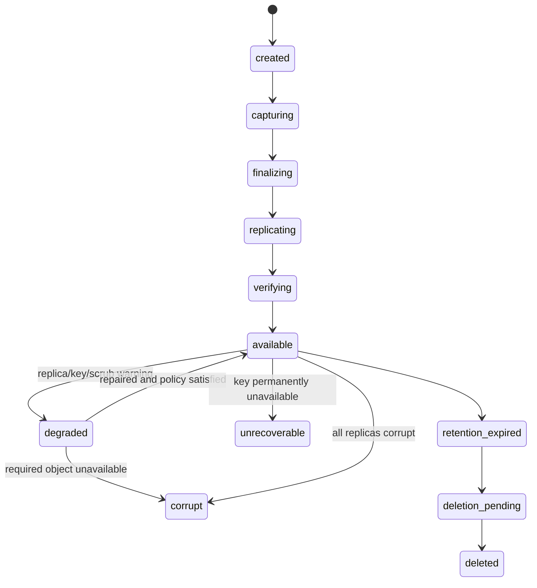
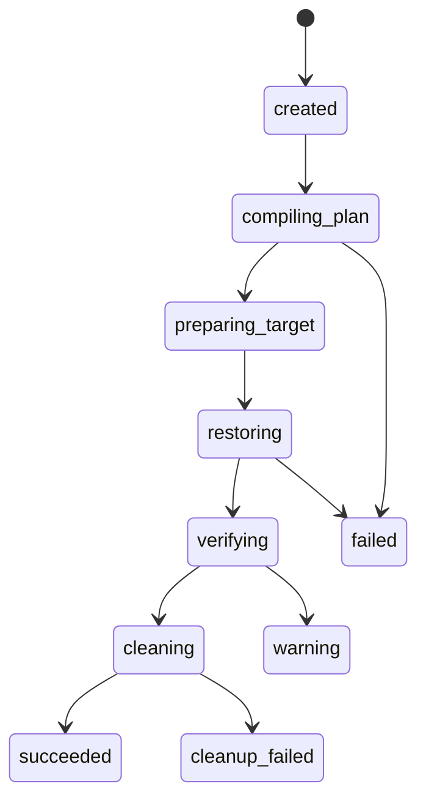

# Environment Archive 与 Restore 领域模型

> **设计标记**：`[已确认设计]` 表示架构基线；`[建议方案]` 表示实施阶段需通过评审确认；`[待决策]` 表示尚未冻结。若本文件与权威来源冲突，以 [`source-of-truth-map.md`](../00-governance/source-of-truth-map.md) 的映射为准。

## 目的

本文件将总体设计中的相关决策下沉为可直接用于研发、评审和验收的规范。实现不得通过 UI 隐藏、临时内存状态或未审查脚本绕过这里定义的边界。

## 设计口径

- **事实与合同分离**：Snapshot/Evidence 描述观察事实；Blueprint 描述业务合同；Plan 描述本次执行；Run 记录真实证据。
- **不可变输入**：确认后的 Revision 与批准后的 Plan 不原地修改。
- **高风险操作显式化**：审批、Secret、Dataset、Cutover、Commit、Rollback 均为一等对象。
- **证据优先**：状态必须由 Attempt、Checkpoint、Verification、Manifest 或 Commit Record 支撑。
## 5.22 EnvironmentArchive 与 ArchiveVersion

| 对象 | 职责 | 核心不变量 | 持久化 |
|---|---|---|---|
| EnvironmentArchive | 长期资产的稳定身份、Policy 和当前版本 | 删除不级联历史证据 | `archive.archives` |
| ArchiveVersion | 一次不可变 Capture | finalized 后内容不可修改；新 Capture 新版本 | `archive.versions` |
| ArchiveManifest | 自描述恢复索引、Root Hash、对象与合同 | 完整 Manifest 加密并签名 | Object Storage + DB 索引 |
| ArchiveReplica | 某 Repository 中的完整副本 | Archive 可用性由 Replica Policy 计算 | `archive.replicas` |
| ScrubRun | 主动读取、校验和修复 | HEAD/存在不等于 Scrub | `archive.scrub_runs` |
| RestoreDrillRun | 在隔离目标真实重建和验证 | 新 Version 不继承旧 Drill 结论 | `archive.restore_drill_runs` |
| SourceReleaseCommitRecord | 证明当前 Policy 下允许释放源 | 无该记录不得建议释放源 | `archive.source_release_commits` |

Archive 同时维护 IntegrityLevel 与 RecoverabilityLevel，并通过多维 Health 计算整体状态。

## 12.11 ArchiveVersion

## 12.12 RestoreDrillRun

## Archive 身份

`EnvironmentArchive` 是稳定目录身份；`ArchiveVersion` 是一次不可变 Capture。Restore Project 必须针对当前目标重新编译，不能复用 Capture Action。

## 可恢复性

Integrity 和 Recoverability 独立评估。对象完整但 Key 不可用时 Archive 仍不可恢复；只有 Drill 达到 Policy 等级才可以支持 Source Release。
