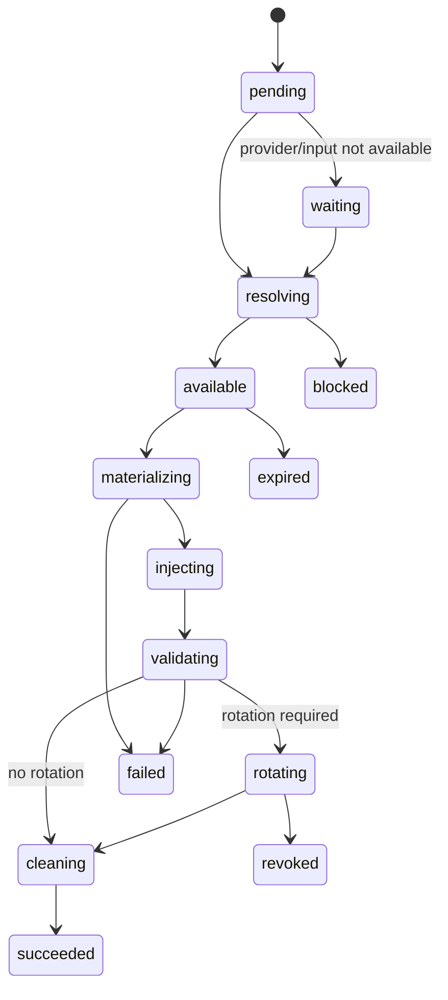

# Secret 领域模型

> **设计标记**：`[已确认设计]` 表示架构基线；`[建议方案]` 表示实施阶段需通过评审确认；`[待决策]` 表示尚未冻结。若本文件与权威来源冲突，以 [`source-of-truth-map.md`](../00-governance/source-of-truth-map.md) 的映射为准。

## 目的

本文件将总体设计中的相关决策下沉为可直接用于研发、评审和验收的规范。实现不得通过 UI 隐藏、临时内存状态或未审查脚本绕过这里定义的边界。

## 设计口径

- **事实与合同分离**：Snapshot/Evidence 描述观察事实；Blueprint 描述业务合同；Plan 描述本次执行；Run 记录真实证据。
- **不可变输入**：确认后的 Revision 与批准后的 Plan 不原地修改。
- **高风险操作显式化**：审批、Secret、Dataset、Cutover、Commit、Rollback 均为一等对象。
- **证据优先**：状态必须由 Attempt、Checkpoint、Verification、Manifest 或 Commit Record 支撑。
## 5.18 SecretRequirement、SecretProviderBinding 与 SecretDeliveryRun

| 对象 | 职责 | 核心不变量 | 持久化 |
|---|---|---|---|
| SecretRef | Snapshot 中的引用证据 | 不是可恢复 Secret；值默认 never-read | Snapshot/Evidence |
| SecretRequirement | Blueprint 中对 Secret 的逻辑需求 | 不包含值；声明连续性、注入、验证与恢复要求 | Blueprint JSONB + index |
| SecretProviderBinding | DecisionSet 中选择来源、版本和轮换策略 | Provider Credential 与 Workload Secret 分离 | `secret.provider_bindings` |
| SecretExecutionContract | Plan 中的 JIT 解析、交付、验证、清理合同 | 只保存逻辑引用和 binding hash | `secret.execution_contracts` |
| SecretDeliveryRun | 实际解析、物化、注入、验证、轮换和清理 | Secret 值不得进入普通 DB/Event/Log | `secret.delivery_runs` 等 |

Provider 类型：user-input、vault、sops、target-existing、regenerate、out-of-band、cloud secret manager、可选 managed escrow。

## 12.9 SecretDeliveryRun

## 分离规则

`SecretRef` 是发现证据；`SecretRequirement` 是 Blueprint 需求；`SecretProviderBinding` 是 Decision；`SecretExecutionContract` 是 Plan 合同；`SecretDeliveryRun` 是运行证据。任何一层都不得把明文写入普通数据库、Event、Checkpoint 或 Report。
