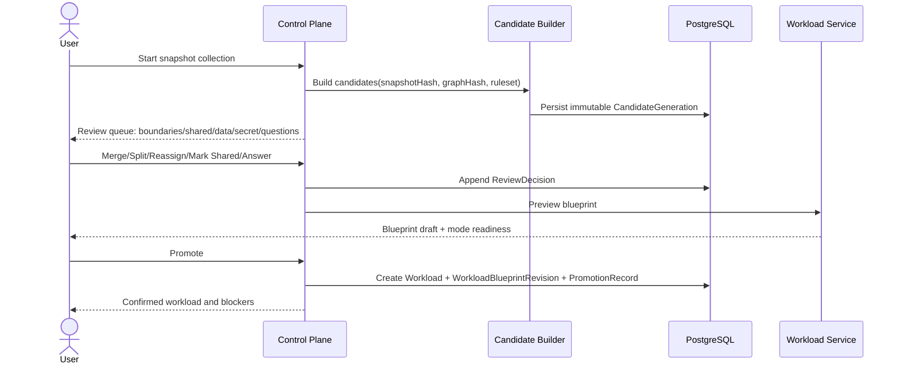

# Workload Candidate 与人工 Review

> **设计标记**：`[已确认设计]` 表示架构基线；`[建议方案]` 表示实施阶段需通过评审确认；`[待决策]` 表示尚未冻结。若本文件与权威来源冲突，以 [`source-of-truth-map.md`](../00-governance/source-of-truth-map.md) 的映射为准。

## 目的

本文件将总体设计中的相关决策下沉为可直接用于研发、评审和验收的规范。实现不得通过 UI 隐藏、临时内存状态或未审查脚本绕过这里定义的边界。

## 设计口径

- **事实与合同分离**：Snapshot/Evidence 描述观察事实；Blueprint 描述业务合同；Plan 描述本次执行；Run 记录真实证据。
- **不可变输入**：确认后的 Revision 与批准后的 Plan 不原地修改。
- **高风险操作显式化**：审批、Secret、Dataset、Cutover、Commit、Rollback 均为一等对象。
- **证据优先**：状态必须由 Attempt、Checkpoint、Verification、Manifest 或 Commit Record 支撑。
## 5.6 CandidateGeneration 与 WorkloadCandidate

| 属性 | 设计 |
|---|---|
| 职责 | 把 Snapshot 和 Inventory Graph 转化为一组边界假设、组件、关系、问题和冲突 |
| 核心字段 | Generation：Snapshot/Graph/Builder/Ruleset Hash；Candidate：proposed identity、components、relations、evidence assignments、confidence、completeness、questions、conflicts、recommendations |
| 不变量 | Candidate 永远不能直接产生 Plan Action；Generation 发布后不修改；旧 Generation 不被新 Snapshot 覆盖 |
| 生命周期 | generated → boundary-review → contract-review → blocked/ready-for-confirmation → confirmed/superseded/dismissed |
| 关系 | Review Session 读取 Candidate；Promotion 创建 Workload 与 Blueprint Revision |
| 聚合根 | `CandidateGeneration`；Candidate 是其不可变成员 |
| 持久化边界 | `discovery.candidate_generations`、`workload_candidates`、`candidate_components`、`candidate_questions` |

自动合并仅在存在强关系、无共享冲突、无 Critical Question、关键 Collector 完整时允许。共享数据库、Nginx、Redis、目录、跨团队或不同 Cutover 生命周期必须要求用户确认。

## 5.7 CandidateReviewSession 与 ReviewDecision

| 属性 | 设计 |
|---|---|
| 职责 | 将机器推断转化为人工确认的业务边界和可编译合同 |
| 核心操作 | confirm、merge、split、reassign evidence、mark shared、exclude、dismiss、answer question、promote |
| 核心字段 | `sessionId`、`generationId`、`status`、ReviewItem、Decision、actor、reason、evidenceRefs、resulting ownership |
| 不变量 | 每个 Critical Evidence 必须被 exclusive/shared/reference/external/excluded/unresolved 之一处理；exclusive Evidence 只能有一个 owner；共享资源必须有处理方式 |
| 生命周期 | open → reviewing → blocked/ready → promoted/closed |
| 关系 | 产生 Workload、Blueprint Draft、Decision Audit；不修改原 Candidate |
| 聚合根 | `CandidateReviewSession` |
| 持久化边界 | Review Decision append-only；Promotion 与 Workload/Blueprint 创建在一个受控事务或 Saga 中完成 |

人工补全覆盖 identity、components、runtime、deployment、config、dataset、secret、endpoint、scheduled task、ephemeral state 和 verification。Unknown 可以被保存，但必须阻塞受影响模式。

## 16.1 Candidate Review 与人工补全

关键规则：所有 Critical Evidence 有处置；Promotion 不修改 Candidate；Shared Resource 形成独立 Workload 或显式外部/复用策略。

## Review 完成定义

Review 不是确认“候选名称”，而是完成业务边界、Evidence 所有权、共享资源、Runtime、Deployment、Config、Dataset、Secret、Endpoint、Scheduled Task、Ephemeral State 和 Verification 合同。

## Evidence 所有权

`exclusive | shared | reference | external | excluded | unresolved`。Critical Evidence 不得在 Promotion 时保持未归属；`unresolved` 必须使受影响模式 readiness=blocked。
