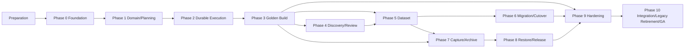

# 阶段依赖图

```mermaid
flowchart LR
 P[Preparation] --> P0[Phase 0 Foundation]
 P0 --> P1[Phase 1 Domain/Planning]
 P1 --> P2[Phase 2 Durable Execution]
 P2 --> P3[Phase 3 Golden Build]
 P3 --> P4[Phase 4 Discovery/Review]
 P3 --> P5[Phase 5 Dataset]
 P4 --> P5
 P5 --> P6[Phase 6 Migration/Cutover]
 P5 --> P7[Phase 7 Capture/Archive]
 P3 --> P7
 P7 --> P8[Phase 8 Restore/Release]
 P3 --> P9[Phase 9 Hardening]
 P6 --> P9
 P8 --> P9
 P9 --> P10[Phase 10 Integration/Legacy Retirement/GA]
```

Cutover 依赖 Durable Execution 和 Dataset；Archive 依赖 Dataset/Secret/Verification；Restore 依赖 Archive Health 和当前 Target Compatibility；Phase 10 依赖所有能力 Phase PASS，并只负责集成和收尾。
